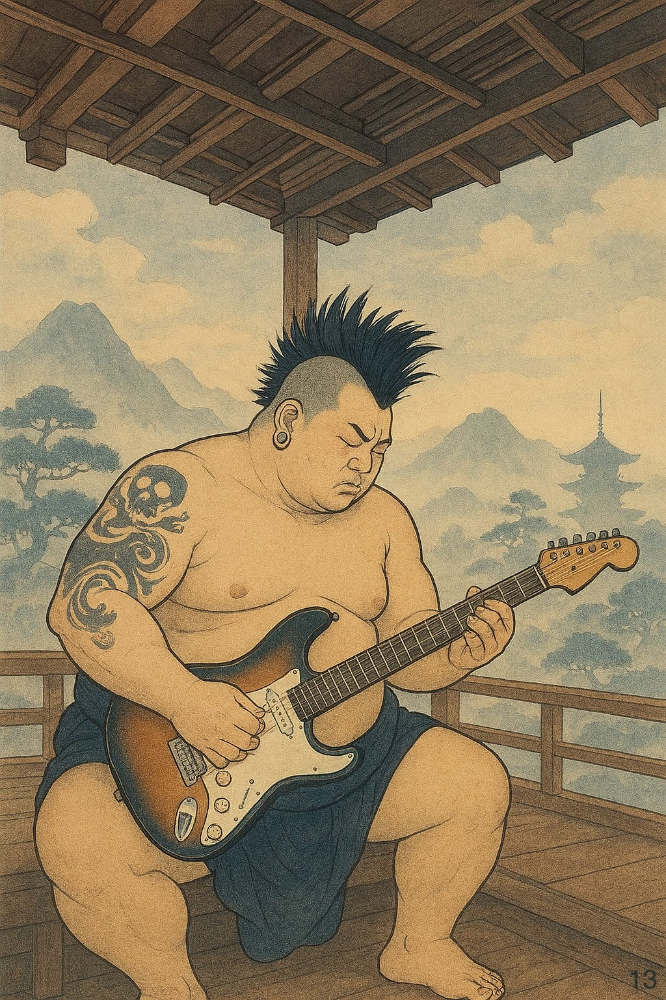

# Cose Belle & Altre Storie - Edizione #13
*Sabato 01 Novembre 2025 - Il buongiorno del weekend*

---

## Buongiorno, esploratori!

Un'altra settimana è volata via, e eccoci qui. Edizione numero 13. So già cosa state pensando: tredici porta sfortuna, no? Beh, in realtà dipende da dove vi trovate. In Italia è il 17 il numero da evitare (colpa dell'anagramma latino XVII = VIXI, "vissi", quindi "sono morto"), mentre nei paesi anglosassoni il 13 è quello sospetto da secoli, alimentato da Last Supper, Giuda e tutto il repertorio medievale. Ma sapete una cosa? Dopo aver passato Halloween al calduccio sul divano con The Bear invece che fuori a congelarmi travestito, e dopo aver affrontato il primo giorno di palestra dopo anni superando l'inerzia del riposo come un corpo che resiste alle leggi del moto newtoniano, direi che la fortuna è relativa. Forse il vero numero sfortunato è quello sulla bilancia.

> Every second counts\
> The Bear

Prendetevi un caffè (o quello che preferite), e iniziamo questa tredicesima esplorazione. Scaramanzia permettendo.

---

## In Questo Numero

Questa settimana parliamo di battaglie che si combattono nell'immaginario collettivo, dove dinosauri gonfiabili sconfiggono il potere meglio di mille slogan razionali. Scopriremo perché i lottatori di sumo sono molto più di atleti sovrappeso, come funziona davvero una chitarra elettrica (spoiler: è fisica pura), e perché il web che conosciamo sta morendo mentre noi guardiamo altrove. Ah, e c'è un software per impedire al vostro gatto di rovinare il vostro lavoro camminando sulla tastiera. Perché anche questo è un problema che merita soluzioni ingegneristiche.

---

## La Riflessione della Settimana

### Quando i Dinosauri Gonfiabili Battono i Re: La Battaglia dell'Immaginario

C'è una frase che mi ha colpito questa settimana, ed è questa: **"Finché continueremo a combattere sul piano razionale chi opera sul piano simbolico, continueremo a perdere."**

Suona familiare? Dovrebbe. Perché è esattamente quello che succede quando pensiamo che basti avere ragione, portare dati, costruire argomentazioni logiche impeccabili per vincere una battaglia politica o culturale. 
Il problema è che mentre noi scriviamo saggi e fact-checking, dall'altra parte qualcuno sta disegnando un re con la corona che defeca sulla folla. E quella immagine, per quanto disgustosa, è potere primordiale. È simbolo che bypassa completamente la corteccia prefrontale e va dritto all'amigdala.

Ma c'è una storia recente che ribalta questo schema, e viene da Portland. Si chiama "No Kings" ed è una protesta contro Trump che ha capito una cosa fondamentale: se il potere opera sul piano simbolico, devi rispondergli sullo stesso piano. Ma non con la stessa violenza, non con lo stesso disprezzo. Con qualcosa di completamente diverso: la gioia radicale incarnata in costumi gonfiabili di dinosauri, unicorni, polli giganti.

Sembra ridicolo? È esattamente questo il punto.

Come racconta [questo articolo illuminante](https://www.tlonletter.it/p/come-battere-davvero-trump-vestiti), le proteste No Kings hanno capito che *la battaglia decisiva si combatte nell'immaginario, e bisogna operare sul piano simbolico con la stessa consapevolezza con cui Trump lo fa, ma ribaltandone completamente il registro*. 
Mentre Trump usa l'immagine del re che umilia la plebe, del padre arcaico che può violare ogni regola, i manifestanti rispondono con creature gonfiabili che sono *simultaneamente troppo innocenti per essere combattute con violenza legittima, e troppo stranianti per essere semplicemente ignorate*.

Pensateci un momento. Come reprimi violentemente un dinosauro gonfiabile? Come giustifichi l'uso della forza contro un pollo gigante? È complicato, no? Come ha detto uno degli organizzatori: "È davvero difficile definire 'zona di guerra' quando quello che vedi è una festa di quartiere con gente in costume di Halloween." 
L'immagine della repressione diventa grottesca, perde ogni legittimità simbolica, ed espone il potere per quello che è: brutale, sproporzionato, ridicolo nella sua paranoia.

C'è anche un aspetto ancora più profondo, quasi filosofico. Non è solo una questione tattica. 
È un "rifiuto ontologico, non politico", come spiega l'articolo. 
I manifestanti non stanno discutendo con Trump sulla legittimità del suo potere secondo i principi democratici. Stanno semplicemente incarnando un'altra realtà, un'altra possibilità di essere nel mondo. Trump dice: "Io sono il re, e il re può umiliarvi." I manifestanti rispondono: "Tu non sei il nostro re, perché noi siamo rane, dinosauri, unicorni, creature di un altro mondo fantastico che non riconosce la tua autorità."

E questo funziona anche con i simboli dell'avversario. Hanno preso Pepe the Frog, quella che Gary Lachman in "La Stella Nera" definisce *una svastica anfibia postmoderna* dell'alt-right, e l'hanno ribaltato completamente. L'hanno fatto diventare simbolo di protesta anti-Trump, confondendo e destabilizzando i suoi sostenitori. 
**Perché i simboli non appartengono definitivamente a nessuno, e possono essere ripresi, ribaltati, trasformati e ritrasformati.**

Portland ha una lunga tradizione di proteste teatrali: dal World Naked Bike Ride al Wall of Moms durante le proteste per George Floyd. L'idea è sempre la stessa: più il manifestante è vulnerabile, innocente, visibilmente disarmato, più la violenza del potere diventa evidente e insopportabile da guardare. Un ciclista nudo è il manifestante meno minaccioso che esista. Un dinosauro gonfiabile anche.

La lezione qui è potente: in un momento storico in cui la battaglia decisiva si combatte nell'immaginario collettivo, nella capacità di definire quale narrazione della realtà prevarrà, servono nuove strategie. \
Come dice una delle citazioni più belle che ho letto quest'anno: **The greatest act of resistance in the face of darkness is radical joy**.

Gioia radicale. Non rabbia, non disprezzo, non vendetta. Gioia. Quella che si incarna in un costume gonfiabile di T-Rex mentre affronti poliziotti in assetto antisommossa. È resistenza attraverso la vita che persiste, l'innocenza che si rifiuta di farsi corrompere, l'immaginario alternativo che dice: questo mondo è possibile, e noi lo stiamo già vivendo.

E forse, solo forse, questa è la vera rivoluzione del XXI secolo. Non quella che grida più forte o colpisce più duro. Ma quella che balla.

Domanda per voi: in quale campo della vostra vita state combattendo sul piano razionale quando dovreste operare su quello simbolico?

---

## Scoperte & Curiosità

### Quello che non sapevo e ora sì

**Il mondo nascosto dei lottatori di sumo**

Pensate che il sumo sia solo due tizi enormi che si spingono in un cerchio? Preparatevi a ricredervi completamente. Ho passato un'ora a leggere sulla vita dei lottatori di sumo e vi assicuro che è un universo di una complessità affascinante.

Prima di tutto: il sumo non è uno sport. È un rito religioso shintoista con 1500 anni di storia, dove ogni gesto ha un significato sacro. Il sale che lanciano? Purifica il ring. Lo stomping? Scaccia gli spiriti maligni. L'arbitro ha un pugnale alla cintura perché storicamente, in caso di decisione controversa, doveva essere pronto al suicidio rituale per salvare l'onore.

Ma la parte più affascinante è la vita quotidiana. I lottatori vivono in "stable" (scuderie) con regole ferree: svegli alle 5, allenamento a stomaco vuoto fino a mezzogiorno, poi un pasto unico gigantesco di chanko-nabe (uno stufato ipercalorico progettato per massimizzare l'aumento di peso), seguito da circa 4 ore di sonno per rallentare il metabolismo. I giovani apprendisti fanno da servitori ai senior: preparano i bagni, cucinano, lavano i vestiti, puliscono. Non possono guidare auto. Non possono uscire senza il topknot tradizionale. Devono indossare lo yukata anche per strada.

La gerarchia è spietata. Ci sono 6 divisioni, e solo i top 70 (la divisione Makuuchi) guadagnano bene e hanno privilegi. Gli altri sopravvivono con poco o niente. Un lottatore può allenarsi per 10 anni senza mai raggiungere lo status professionale. E quando si ritirano? Molti hanno problemi di salute gravissimi: diabete, problemi cardiaci, ginocchia distrutte. La massa corporea che era il loro potere diventa il loro fardello.

Eppure c'è una dignità in tutto questo, una dedizione totale che raramente vedi in altri sport professionistici. 
Il sumo chiede tutto. E in cambio offre la possibilità di diventare una leggenda vivente.

Se volete approfondire, questi sono i link che ho divorato: [panoramica generale](https://www.sumo.it/curiosita-sui-lottatori-di-sumo.html), [la dura vita quotidiana](https://focusgiappone.net/giapponela-dura-vita-del-lottatore-di-sumo/), [storia e violenza](https://italianozeki.com/2024/05/07/sumo-storia-di-disciplina-onore-e-violenza/), e il [sistema delle classifiche](https://italianozeki.com/banzuke/).

### Il video che vale la pena

**Come funziona davvero una chitarra elettrica**

Vi siete mai chiesti perché una chitarra elettrica senza amplificatore suona così debole? O come fa un pezzo di legno con delle corde a diventare rock'n'roll puro?

La risposta è fisica elegante. Le corde metalliche vibrano sopra dei pickup magnetici (quei rettangolini sotto le corde). Questi pickup sono avvolte di filo di rame attorno a magneti, creando un campo magnetico. Quando la corda vibra, disturba questo campo, generando una minuscola corrente elettrica alternata che replica esattamente la frequenza della vibrazione. Questa corrente viaggia attraverso potenziometri (i pomelli di volume e tono sono resistenze variabili) fino all'amplificatore, che la amplifica centinaia di volte prima di inviarla agli altoparlanti.

Il bello? Ogni componente modifica il suono. Il legno del corpo (body) influenza il sustain e il timbro per via della risonanza. I pickup singoli (single-coil) danno un suono brillante ma captano interferenze elettromagnetiche (quel buzz fastidioso). I pickup doppi (humbucker) cancellano le interferenze ma suonano più scuri e potenti. Anche la distanza dei pickup dalle corde cambia tutto.

È affascinante come uno strumento apparentemente semplice sia in realtà un ecosistema di elettromagnetismo, acustica e risonanza che interagiscono in modo incredibilmente complesso. Se volete capire ogni dettaglio, [questo articolo tecnico](https://www.guyker.com/it-it/blogs/guide/how-do-electric-guitars-work) è perfetto, mentre [questa animazione interattiva](https://animagraffs.com/how-an-electric-guitar-works/) è semplicemente stupenda.

### La lettura intelligente

**L'ultima cena del web (e non ce ne siamo accorti)**

"Il web sta morendo e nessuno sembra accorgersene." Così inizia [questo articolo di Macitynet](https://www.macitynet.it/lultima-cena-del-web/) che merita tutta la vostra attenzione.

L'idea è semplice ma inquietante: ogni volta che aprite ChatGPT invece di Google, ogni volta che lasciate che Claude riassuma un articolo invece di leggerlo, ogni volta che Gemini risponde a una domanda senza farvi cliccare su un link, state assistendo alla morte silenziosa del web come lo conosciamo.

Non è una morte drammatica. È una trasformazione. Il web era un ecosistema dove i creatori di contenuti venivano visitati, generavano traffico, monetizzavano con pubblicità o abbonamenti. Ora? I grandi modelli linguistici digeriscono tutto il web, lo comprimono in pesi neurali, e lo rigurgitano in risposte che non portano traffico a nessuno. Zero click, zero visibilità, zero revenue per chi ha creato quel contenuto.

L'articolo fa un parallelo agghiacciante: "È come andare al cinema, sedersi in una stanzetta buia e attendere qualcuno che viene a raccontarci il film invece di lasciarcelo vedere”. 
I grandi modelli sono l'entropia informativa del XXI secolo: **massima efficienza, minima attribuzione**.

Cosa succederà quando nessuno avrà più incentivo a creare contenuti originali perché tanto finiscono solo come training data? 
Chi alimenterà la conoscenza che questi modelli utilizzano? 
È un circolo vizioso che potrebbe implodere.

Il web come spazio da esplorare, con link da seguire e rabbit hole da scoprire, potrebbe davvero essere una reliquia del passato. 
Forse tra vent'anni guarderemo indietro con nostalgia, come oggi guardiamo alle biblioteche o ai negozi di dischi. Un'epoca in cui dovevi *cercare* le cose, non solo *chiederle*.

---

## Intrattenimento (Mica) Banale

### Qualcosa che fa sorridere (ma non solo)

**PawSense: il software che protegge il tuo lavoro dai gatti**

Ok, questa è geniale. Esiste un software chiamato [PawSense](http://www.bitboost.com/pawsense/pawsense-faq.html) che rileva quando un gatto sta camminando sulla vostra tastiera e blocca automaticamente il computer per impedire danni.

Come funziona? Analizza i pattern di digitazione in tempo reale. Se rileva troppe sequenze impossibili (tipo "jjjjjjksssss"), troppi tasti premuti contemporaneamente, o sequenze completamente casuali, assume che sia un gatto e non un umano. A quel punto blocca tutto e riproduce un suono fastidioso per allontanare il felino.

È ridicolo? Sì. È necessario? Se avete un gatto, probabilmente sì. Quante volte vi è capitato di tornare al computer e trovare che il gatto ha chiuso 15 finestre, inviato email incomplete, o peggio ancora eseguito comandi critici? Questo è il tipo di problema che merita una soluzione algoritmica.

Bonus: [questo articolo](https://lifehacker.com/get-a-decoy-keyboard-for-your-cat-to-enjoy-1833554607?test_uuid=02DN02BmbRCcASIX6xMQtY9&test_variant=B) spiega anche altre strategie per gestire i gatti tecnologicamente irrequieti, inclusa la creazione di decoy keyboard (tastiere finte piazzate strategicamente per distrarli). Perché a volte la soluzione migliore non è la tecnologia, ma l'ingegneria sociale felina.

---

## La Colonna Sonora

**Per rimanere in tema con The Bear e chitarre elettriche**
[Refused - New Noise](https://www.youtube.com/watch?v=NkAe30aEG5c)

Ditemi se non è pazzesco questo riff...

---

## & Un'Altra Cosa

C'è qualcosa di strano nel fatto che il 13 porti sfortuna e il 17 anche, ma in paesi diversi. Come se le superstizioni fossero localizzate geograficamente, ancorate a storie e culture specifiche. Il 4 è sfortunato in Giappone perché si pronuncia come "morte". In alcune parti della Spagna il martedì 13 è il giorno sfortunato, non il venerdì. In Italia il 17 deriva dall'anagramma latino VIXI.

Tutto questo per dire: **la paura è narrativa**. È storia che ci raccontiamo. E forse, invece di evitare i numeri sfortunati, dovremmo ricordarci che il potere dei simboli esiste solo finché continuiamo a crederci. I manifestanti di Portland l'hanno capito con i loro dinosauri gonfiabili. Forse dovremmo farlo anche noi con le nostre superstizioni quotidiane.

Oppure, sapete cosa? Potrei sbagliarmi completamente e questa tredicesima edizione  potrebbe davvero portare sfortuna. Nel qual caso, ci rivediamo nella prossima. Se sopravvivo.

---

## Prima di Salutarci...

E anche questa settimana è fatta! Tredici edizioni. Un numero che secondo alcune culture porta sfortuna, secondo altre è solo un numero come gli altri. Ma per me è semplicemente un'altra occasione per condividere cose che trovo interessanti, nella speranza che almeno una vi faccia pensare, sorridere, o scoprire qualcosa di nuovo.

Se qualcosa vi ha colpito, se avete pensieri su dinosauri gonfiabili o gatti che camminano sulle tastiere, o semplicemente volete dire la vostra, sapete dove trovarmi. E se pensate che qualcuno tra i vostri contatti potrebbe apprezzare queste piccole collezioni settimanali, be', condividete pure.

Buon sabato, buon inizio novembre, e alla prossima esplorazione.

---

*PS: Questa newsletter ha come unico scopo quello di condividere curiosità e belle scoperte. Tutti i link e i contenuti sono selezionati a titolo personale e gratuito.*

*Se sei arrivato fin qui, evidentemente qualcosa ti ha incuriosito. Bene! Puoi iscriverti per ricevere queste piccole collezioni ogni sabato (promesso, non spammo), oppure condividerle con chi secondo te potrebbe apprezzare. O entrambe le cose, che non guasta.*