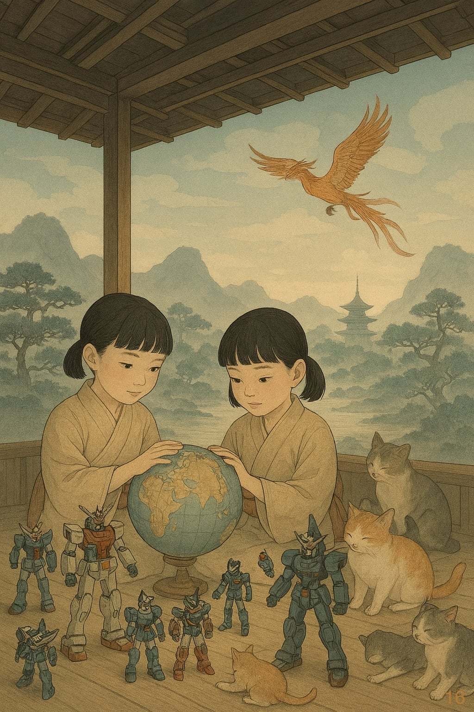

# Cose Belle & Altre Storie - Edizione #16
*Sabato 22 Novembre 2025 - Il buongiorno del weekend*

---

## Buongiorno, esploratori!

Un'altra settimana è volata via, e come ogni sabato mattina è il momento di fare il punto: cosa mi ha colpito, cosa vale la pena condividere, cosa merita di essere raccontato. Sette giorni di internet, libri, conversazioni e scoperte varie che ho raccolto per voi in 10 minuti (circa) di lettura.

Questa settimana è iniziata la Grande Caccia alle Luci Natalizie. Un'attività che, ogni anno, mi ricorda quanto il secondo principio della termodinamica si applichi anche alle decorazioni domestiche: l'entropia aumenta sempre, e le luci dell'anno scorso che "funzionavano perfettamente" misteriosamente ora hanno tre file morte. Tra mercatini che spuntano come funghi e la ricerca delle luminarie perfette, ho vissuto quel particolare mix di entusiasmo natalizio e frustrazione logistica che caratterizza novembre. Ma tra una ricerca e l'altra, ho anche trovato il tempo per impersonare un gatto randagio in una città cyberpunk e devo dire che, dopo una settimana di lavoro, l'idea di fare a cambio non sembra poi così assurda.

> Logic doesn't apply to the real world.
> Marvin Minsky

Prendetevi un caffè (o quello che preferite), e via con questa sedicesima esplorazione.

---

## In Questo Numero

Questa settimana parliamo di potere e dei modi in cui lo raccontiamo. C'è Charlie Chaplin che nel 1940 ridicolizzava Hitler ballando con un mappamondo, robot giganti giapponesi che hanno trasformato un flop commerciale in una critica della guerra, e una fenice che ci insegna che certi legami non sono trasferibili. Più: gemelli che stanno riscrivendo l'epigenetica, gatti cyberpunk che forse hanno la vita che tutti vorremmo, e bollette cloud che farebbero impallidire il PIL di alcuni Stati. Andiamo.

---

## La Riflessione della Settimana

### **Quando ridere del potere è l'unica arma rimasta**

"Nel momento in cui il potere diventa gracioso, l'unica risposta adeguata è la risata." Non ricordo chi l'abbia detto per primo, ma la verità di questa frase risuona potente guardando una scena specifica de "Il Grande Dittatore" di Charlie Chaplin: il monologo del mappamondo.

La scena è celebre: il dittatore Adenoid Hynkel (parodia neanche troppo velata di Adolf Hitler) danza con un mappamondo gonfiabile, cullandolo come fosse un neonato, sognando la conquista del mondo. È grottesca, buffa, perfettamente calibrata. Ma dietro quella danza c'è un monologo interiore di una profondità agghiacciante che vale la pena riesaminare oggi, 85 anni dopo.

**Il delirio estetico del totalitarismo**

Nel suo delirio, Hynkel non parla solo di conquista militare. Parla di "nazione di Biondi dagli occhi blu", di "bellissimi Biondi Ariani", di eliminare "Ebrei" e "Bruni" per costruire questa visione perfetta. Il genocidio viene mascherato da progetto estetico. Le vittime cessano di essere persone e diventano imperfezioni in un grande disegno da correggere.

Questa strategia — la disumanizzazione attraverso l'estetica — non è un'invenzione cinematografica. È il cuore della propaganda totalitaria. E quello che rende il monologo ancora più inquietante è che Chaplin lo scrisse e girò nel 1940, quando i campi di sterminio non erano ancora pubblicamente noti. La sua satira anticipava orrori che il mondo stava per scoprire.

**La debolezza percepita come invito**

Ma c'è un altro elemento cruciale nel monologo. Hynkel non è solo folle; è calcolatore. La sua ambizione si nutre della percezione che "il mondo è debole, esausto, impaurito" e che "nessuno oserà opporsi". Non è violenza casuale, è predazione strategica. Si parte dall'Austria perché nessuno reagirà. Poi si prosegue, perché nessuno può fermarti.

Questa logica — testare i limiti, sfruttare la paralisi altrui, avanzare dove c'è vuoto di opposizione — non appartiene al passato. Basta guardare le mappe geopolitiche degli ultimi anni per riconoscere il pattern. Non faccio nomi (anche se forse dovrei), ma la storia di Hynkel che danza col mappamondo non è solo memoria, è manuale operativo ancora in uso.

**La paura di sé stessi**

E poi c'è il dettaglio più sorprendente: quando il suo interlocutore lo incita a perseguire il suo destino di "dittatore del mondo", Hynkel risponde: "Non dire così, mi fai avere paura di me stesso."

Questa frase è il cuore oscuro del monologo. Il dittatore ha paura. Ma di cosa? Della propria mostruosità? O della natura autodistruttiva della propria ambizione? È un lampo di autocoscienza o solo terrore narcisistico di fronte alla grandezza del proprio delirio?

Non lo sappiamo. Ma quella fragilità rende il personaggio infinitamente più complesso e, paradossalmente, più terrificante. Non è solo un mostro. È un uomo spaventato dalla propria mostruosità. E questa consapevolezza parziale, invece di fermarlo, lo rende ancora più pericoloso.

**E oggi?**

Guardando ai leader contemporanei — e ai mappamóndi che alcuni di loro sembrano accarezzare con simile dedizione — viene da chiedersi: in quale silenzio si nasconde la stessa paura? Chi sta ballando con i propri sogni di dominio, terrorizzato dalla propria grandezza ma incapace di fermarsi?

Chaplin sapeva che l'unica risposta al potere che diventa grottesco è renderlo ridicolo. Non si combatte il totalitarismo solo con l'opposizione frontale, ma anche con la satira che ne svela l'assurdità. Il Grande Dittatore uscì nel 1940, quando ridere di Hitler era un atto di coraggio politico. Chaplin rischiò tutto per fare quella satira, e vinse.

La domanda che lascia aperta è: abbiamo ancora il coraggio di ridere del potere? O siamo diventati troppo "deboli, esausti, impauriti" per osare opporci, anche solo con una risata?

Approfondimenti: [Il Grande Dittatore - Scena del Mappamondo](https://www.youtube.com/watch?v=p2VBS3NHg6w)

---

## Scoperte & Curiosità

### Quello che non sapevo e ora sì

**I gemelli stanno riscrivendo l'epigenetica, alimentando un impero hollywoodiano, e mettendo sotto stress il sistema sanitario (tutto insieme)**

C'è un motivo per cui l'Istituto Superiore di Sanità tiene un registro con 25.000 gemelli italiani, di cui 3.500 bambini sotto i 12 anni. Non è solo statistica: è un gigantesco esperimento naturale che sta riscrivendo la nostra comprensione della genetica. Ma c'è anche un motivo per cui due sorelle gemelle a New York sono diventate "quasi monopoliste" nel business dell'intrattenimento. E sorprendentemente, i due fenomeni — scienza d'avanguardia e show business — raccontano la stessa storia: i gemelli sono diventati una risorsa scarsa, preziosa e incredibilmente versatile.

**La rivoluzione epigenetica (che parte dall'Italia)**

Il punto non è più solo quantificare quanto conti "natura" vs "cultura" nell'insorgenza delle malattie (quello lo sappiamo fare da decenni). La nuova frontiera è l'epigenetica: lo studio dei meccanismi che "accendono e spengono" l'espressione dei geni senza modificare il DNA. E i gemelli identici — che condividono il 100% del DNA ma solo lo 0,4% delle nascite mondiali — sono lo strumento perfetto per capire come l'ambiente modelli questa espressione.

L'Italia partecipa a HEALS, un progetto europeo che osserverà 1.500 gemelli neonati in 10 Paesi. L'obiettivo è mappare come le esposizioni ambientali (inquinamento, dieta, stress) influenzino l'epigenetica fin dal concepimento. È scienza di frontiera che potrebbe riscrivere la medicina preventiva.

**Il monopolio hollywoodiano nato da un ristorante**

Ora saltiamo a Manhattan, 1994. Due sorelle gemelle identiche, Debbie e Lisa Ganz, aprono il "Twins Restaurant" sulla Second Avenue. Hanno raccolto 400.000 dollari (anche dall'attore Tom Berenger), decorato il locale con doppie eliche di DNA, e imposto una regola ferrea: personale composto solo da gemelli identici. Se uno si ammala, anche l'altro resta a casa. Non è un ristorante, è un manifesto della gemellarità.

La loro intuizione geniale? Avevano capito che la "gemellarità" non era solo un tratto personale, ma una risorsa economica. E Hollywood aveva un problema perfetto per loro: le leggi sul lavoro minorile limitano le ore che un bambino può lavorare sul set. I gemelli sono la soluzione — quando uno raggiunge il limite, lo sostituisci col fratello identico. Le riprese continuano, la legge è rispettata, la produzione risparmia tempo e denaro.

Il ristorante divenne un fenomeno mediatico. Le sorelle finirono da Oprah Winfrey. I produttori iniziarono a chiamarle direttamente. Nel 1999 chiusero il locale e aprirono la Twins Talent Management. Oggi, se un produttore cerca gemelli, chiama loro. Hanno lavorato su Law & Order, Orange Is the New Black, The Marvelous Mrs. Maisel. Ogni anno portano 50 coppie al festival di Twinsburg, Ohio. Hanno presidiato una nicchia fino a diventarne sinonimo.

Ma il loro business va oltre Hollywood. Forniscono gemelli per test su tecnologie biometriche (le impronte digitali sono diverse tra gemelli, ma il riconoscimento facciale va in crisi), per ricerche mediche che necessitano di soggetti con DNA identico, per qualsiasi situazione dove l'uniformità genetica perfetta sia un vantaggio competitivo. Hanno trasformato l'identità in commodity.

**Il rovescio della medaglia: il sistema sanitario in affanno**

Ed è qui che la storia si complica. Perché negli ultimi vent'anni, i parti gemellari in Italia sono aumentati del 25%. Non è un fenomeno naturale: è colpa dell'età materna più elevata (2,4% di parti plurimi sopra i 40 anni) e soprattutto della procreazione assistita (19,8% di gravidanze multiple).

Il risultato? Un quarto di tutti i parti pretermine in Italia è gemellare. Le Terapie Intensive Neonatali faticano a stare dietro alla domanda. I gemelli prematuri necessitano di cure intensive, complesse e costose. Il sistema sanitario non ha abbastanza posti per tutti.

Quindi abbiamo un paradosso perfetto: i gemelli sono diventati contemporaneamente (1) la chiave per decifrare l'epigenetica, (2) un business model di successo a Hollywood e oltre, e (3) una sfida sanitaria che mette sotto stress ospedali e risorse pubbliche.

**Tre facce della stessa ossessione**

Quello che rende questa storia così affascinante è che scienza, show business e sanità pubblica stanno tutti guardando ai gemelli con la stessa domanda di fondo: cosa significa essere identici? E quanto vale questa identità?

Per l'ISS e il progetto HEALS, i gemelli sono una finestra sui meccanismi più profondi della vita umana. Per le sorelle Ganz, sono un asset economico da catalogare e distribuire. Per il sistema sanitario, sono una sfida logistica crescente.

Ma alla fine, tutti e tre concordano su una cosa: i gemelli identici sono una risorsa scarsa (0,4% delle nascite), preziosa (DNA uguale = laboratorio naturale perfetto), e sempre più richiesta. Che tu li voglia studiare, ingaggiare per un film, o curare in terapia intensiva neonatale, la domanda supera l'offerta.

E questa, forse, è la lezione più strana: abbiamo trasformato l'essere umano più uniforme che esista — il gemello identico — nella risorsa più diversificata e ricercata che abbiamo. Dalla genetica al cinema, dall'epigenetica alla biometria. L'uniformità perfetta è diventata l'unicità più preziosa.

**Fonti:**

- [Registro Nazionale Gemelli - ISS](https://www.quotidianosanita.it/cronache/articolo.php?articolo_id=17307)
- [Il business dei gemelli delle sorelle Ganz - Il Post](https://www.ilpost.it/2023/01/11/sorelle-ganz-business-gemelli-stati-uniti/)

### Il video che vale la pena

**Che fine ha fatto Fanny, la fenice di Silente?**

Se siete cresciuti con Harry Potter, probabilmente ricordate Fanny: la fenice rossa e dorata che salvò Harry nella Camera dei Segreti accecando il Basilisco e curandolo dal veleno con le lacrime. Ma vi siete mai chiesti cosa sia successo dopo la morte di Silente?

Questo video di "Harry Potter Theory" risponde a quella domanda, e la risposta è più profonda e simbolica di quanto sembrasse. Quando Silente muore, Fanny canta un lamento così straziante che Harry lo sente nascere dentro di sé, come se il dolore stesso avesse preso forma musicale. E poi la fenice se ne va. Per sempre.

J.K. Rowling ha spiegato che la partenza di Fanny era necessaria: "Qualcosa doveva lasciare la scuola per sempre quando Silente è morto. Silente era un uomo insostituibile, e la perdita di Fanny esprime questo simbolicamente."

Il legame tra la fenice e il mago era così unico da non poter essere ereditato. Fanny non cercò un nuovo padrone, non rimase a Hogwarts come reliquia. Partì, perché senza Silente, la sua missione era finita. È una delle lezioni più mature della saga: alcuni legami sono così puri che non possono essere trasferiti, solo ricordati.

E c'è un altro dettaglio che colpisce: entrambe le bacchette — quella di Harry e quella di Voldemort — contenevano piume della stessa fenice. Fanny. La sua lealtà a Silente, involontariamente, ha creato il legame che avrebbe deciso il destino del mondo magico.

Guarda il video: [Fanny dopo la morte di Silente](https://www.youtube.com/watch?v=o8FqDB8Wmn8)

### La lettura intelligente

**Gundam: da flop commerciale a fenomeno culturale (e critica della guerra) che vale 15 miliardi di dollari**

Nel 1979, Yoshiyuki Tomino creò "Mobile Suit Gundam" partendo da una domanda: "Perché gli uomini continuano a farsi la guerra?" La serie, con i suoi temi maturi e la trama complessa, fu un flop totale. Bassi ascolti, scarso merchandise, cancellazione anticipata. Fine.

O così sembrava. Perché pochi mesi dopo, una replica televisiva e soprattutto la produzione di modellini (i "Gunpla") rivolti a un pubblico adulto scatenarono un successo postumo travolgente. Oggi, Gundam è un franchise da oltre 15 miliardi di dollari, con i Gunpla che dominano il 90% del mercato giapponese di modelli in scala.

Ma quello che rende Gundam davvero speciale non sono le vendite. È la rivoluzione concettuale. Prima di Gundam, i robot giganti erano "super robot" invincibili e quasi divini (Mazinger Z, Goldrake). Gundam li ha resi "real robot": macchine da guerra prodotte in massa, che necessitano manutenzione, munizioni, energia. Il robot smette di essere l'eroe e diventa uno strumento, spostando l'attenzione sui piloti e sulla complessità morale della guerra.

Tomino è famoso per il suo approccio cupo: nelle sue opere, gran parte del cast muore, inclusi i protagonisti, per sottolineare il prezzo della guerra. Ha il soprannome "Kill them all Tomino" tra i fan. Non ci sono buoni contro cattivi, solo persone che combattono e soffrono.

In Giappone, l'impatto culturale è paragonabile a Star Wars in Occidente. Ci sono statue a [grandezza naturale](https://en.wikipedia.org/wiki/Statue_of_Unicorn_Gundam) (19,7 metri) a Tokyo, francobolli commemorativi, e persino il Ministero della Difesa ha usato "Gundam" come nome in codice per sistemi militari avanzati.

Un flop che è diventato critica della guerra mascherata da intrattenimento. E forse questo è il paradosso più interessante: una delle narrazioni più potenti sulla tragedia del conflitto è raccontata attraverso gigantesche e affascinanti macchine da combattimento.

---

## Intrattenimento (Mica) Banale

**Qualcosa che fa sorridere (ma non solo)**

Questa settimana ho giocato a "Stray", il videogioco in cui impersoni un gatto randagio in una città cyberpunk sotterranea popolata da robot. E posso confermare: dopo una settimana di riunioni, email e deadline, l'idea di fare a cambio con un gatto che al massimo deve evitare le "Zurk" (creature ostili) e trovare una via d'uscita verso il cielo sembra un ottimo affare.

Il gioco è sorprendentemente profondo. Non hai dialoghi, non hai armi (sei un gatto), ma hai tutto quello che serve: la capacità di miagolare a comando, rovesciare oggetti dalle mensole senza motivo, e grattare i tappeti per il puro piacere di farlo. È fedele alla realtà felina in modo spaventoso.

Ma sotto la superficie c'è una storia malinconica: una civiltà umana collassata, robot che hanno ereditato la società ma non possono uscire dalla città sotterranea, e un gatto che cerca solo di tornare alla superficie. È meditativo, bellissimo visivamente, e ogni tanto ti ricorda che forse la complessità della vita umana è sopravvalutata.

Se vi serve una pausa dall'essere umani, Stray vi fa impersonare un gatto per 8-10 ore. E credetemi, è terapeutico.

Gioca: [Stray su Steam](https://store.steampowered.com/app/1332010/Stray/)

**Il video/cortometraggio che accompagna**

Disney ha rilasciato "Versa", un cortometraggio che affronta la perdita di un figlio. Non è il classico contenuto Disney — niente principesse, niente finali felici facili. È un padre che elabora il lutto attraverso l'arte, cercando di versare il dolore in qualcosa di tangibile.

È breve (8 minuti), intenso, e dimostra che l'animazione può raccontare storie mature senza perdere la sua forza visiva. Se avete bisogno di un momento di riflessione accompagnato da animazione bellissima (ma preparatevi emotivamente), questo è il cortometraggio giusto.

Recensione: [Versa - La Stampa](https://www.lastampa.it/spettacoli/2025/10/22/news/versa_cortometraggio_disney-15362919/)

---

## La Colonna Sonora

 [Disclosure - Latch ft. Sam Smith](https://www.youtube.com/watch?v=93ASUImTedo)

C'è un motivo per cui "Latch" resta una delle collaborazioni più riuscite tra elettronica UK e voce soul. I Disclosure (i fratelli Howard, all'epoca poco più che ventenni) costruiscono una base garage house ipnotica — quel tipo di beat che ti prende e non ti lascia andare. E poi c'è la voce di Sam Smith, all'epoca completamente sconosciuto, che trasforma una traccia dance in qualcosa di emotivamente devastante.

Il testo parla di dipendenza affettiva ("You lift my heart up when the rest of me is down / You enchant me even when you're not around"), ma quello che colpisce è come la produzione rispecchi perfettamente il tema: ti aggancia, ti trattiene, ti fa muovere anche quando vorresti stare fermo.

"Latch" è uscito nel 2012, ha lanciato la carriera di Sam Smith (che dopo un anno avrebbe vinto quattro Grammy) e ha consolidato i Disclosure come produttori capaci di fondere club culture e mainstream senza snaturare né l'una né l'altra. Ancora oggi, ascoltandola, capisci perché ha funzionato: è una traccia che funziona sia in cuffia che in pista, sia come sottofondo che come ascolto attivo.

È il tipo di canzone che ti ritrovi ad ascoltare in loop quando vuoi muoverti ma non vuoi pensare troppo. E qualche volta è esattamente quello di cui hai bisogno.

---

## & Un'Altra Cosa

**ServerlessHorrors: quando il cloud ti manda una bolletta da 104.000 dollari**

Vi piacciono le storie dell'orrore? Eccone una moderna: apri la mail, c'è la bolletta del tuo servizio cloud serverless. Importo: $104.500. Per una settimana di traffico.

Benvenuti su ServerlessHorrors, un blog che raccoglie testimonianze di sviluppatori che hanno ricevuto bollette apocalittiche da Vercel, AWS, Firebase, Netlify e altri. Non sto parlando di 200-300 dollari inaspettati. Parlo di cifre a cinque e sei zeri generate da:

- **Attacchi DDoS non rilevati** (qualcuno spamma il tuo endpoint, tu paghi ogni singola richiesta)
- **Errori di configurazione** (hai dimenticato di settare un limite? Congratulazioni, ora devi un mutuo)
- **Larghezza di banda imprevista** (quel video che hai hostato "tanto è leggero" ha generato 50TB di traffico)
- **Loop infiniti** (un bug nel codice che chiama se stesso all'infinito, mentre il contatore della bolletta fa lo stesso)

Il problema fondamentale del serverless è nel nome: "paghi solo quello che usi" diventa "paghi TUTTO quello che usi", inclusi attacchi, bug, e casi limite che non avevi previsto. E i limiti di spesa? Spesso non funzionano come pensi, o si attivano troppo tardi.

La morale? Il cloud è comodo, scalabile, potente. Ma se non capisci esattamente cosa stai facendo, può costarti più della tua macchina.

Leggete le storie (con cautela): [ServerlessHorrors](https://serverlesshorrors.com/)

Se pensavate che l'entropia delle luci natalizie fosse costosa, provate a configurare male un endpoint serverless. Almeno le lucine, quando si rompono, smettono di consumare.

---

## Prima di salutarci...

E anche questa settimana è fatta! Sedici edizioni — un numero che inizia a sembrare solido, come quelle file di luci che finalmente funzionano tutte (almeno fino all'anno prossimo).

Spero che qualcosa in questa raccolta vi accompagni piacevolmente nel weekend. Se trovate qualcosa che vi incuriosisce particolarmente, o se anche voi state cercando luminarie perfette tra mercatini e negozi online con la stessa determinazione di Hynkel col mappamondo (ma con intenzioni migliori), mi farebbe piacere saperlo.

Buon sabato, e alla prossima esplorazione!

---

*PS: Questa newsletter ha come unico scopo quello di condividere curiosità e belle scoperte. Tutti i link e i contenuti sono selezionati a titolo personale e gratuito.*

---

Se sei arrivato fin qui, evidentemente qualcosa ti ha incuriosito. Bene! Puoi iscriverti per ricevere queste piccole collezioni ogni sabato (promesso, non spammo), oppure condividerle con chi secondo te potrebbe apprezzare. O entrambe le cose, che non guasta.