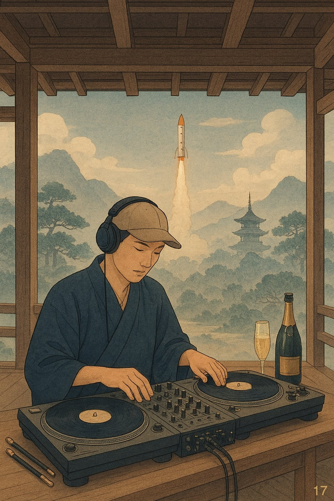

# Cose Belle & Altre Storie - Edizione #17

_Sabato 29 Novembre 2025 - Il buongiorno del weekend_

---

## Buongiorno, esploratori!

Un'altra settimana è volata via, e come ogni sabato mattina è il momento di fare il punto: cosa mi ha colpito, cosa vale la pena condividere, cosa merita di essere raccontato. Sette giorni di internet, libri, conversazioni e scoperte varie che ho raccolto per voi in 10 minuti (circa) di lettura.

Questa settimana i termosifoni sono passati dallo status di "oggetti decorativi" a "necessità esistenziale". Quando fuori ci sono -2 gradi, la seconda legge della termodinamica smette di essere teoria e diventa esperienza sensoriale diretta: il calore fluisce inesorabilmente dal caldo al freddo, e tu puoi solo decidere da che parte stare. Ho scelto il lato caldo, ovviamente. Bologna, nel frattempo, mi ha riservato una piccola scoperta: anche lei ha la sua torre pendente. Nulla da invidiare a quella di Pisa, se non forse qualche milione di turisti all'anno. Ma il segnale più inequivocabile che l'inverno è ufficialmente arrivato? Le prime luci natalizie nei negozi. È ufficiale: Natale si sta davvero avvicinando, con la stessa inesorabilità con cui l'entropia aumenta nell'universo.

> Never trust a computer you can't lift. 
> Macintosh

Prendetevi un caffè (o quello che preferite - io ho optato per un tè caldo che potrebbe riscaldare un piccolo pianeta) e iniziamo questa piccola collezione di cose belle & altre storie.

---

## In Questo Numero

Questa settimana parliamo di come umani e intelligenza artificiale potrebbero non essere più due cose separate, ma qualcosa di nuovo che la biologia evolutiva conoscerebbe bene. Poi ci perdiamo tra lanci spaziali che possiamo seguire in tempo reale come se fossero partite di calcio, bacchette magiche che scelgono i maghi per motivi decisamente sinistri, bottiglie di spumante che sembrano sculture, un produttore svedese che ha conquistato YouTube senza dire una parola, e palme tropicali che rendono le giornate di lavoro meno grigie.

È una di quelle edizioni dove tutto sembra disconnesso finché non ci pensi troppo. Oppure dove tutto è connesso e io sto solo cercando di giustificare le mie scelte di lettura della settimana.

---

## La Riflessione della Settimana

**Il simbionte: quando tu e la tua AI diventate la stessa cosa**

C'è un articolo scientifico pubblicato sui _Proceedings of the National Academy of Sciences_ che propone una teoria così elegante da sembrare ovvia solo dopo averla letta: umani e intelligenza artificiale non stanno semplicemente interagendo. Stanno diventando un unico organismo evolutivo. Un simbionte.

L'analogia che usano i ricercatori è brillante nella sua semplicità: pensate alle cellule eucariotiche, quelle che compongono piante, animali e voi mentre leggete queste righe. Miliardi di anni fa, due microbi completamente separati hanno iniziato a collaborare. All'inizio erano solo vicini di casa. Poi coinquilini. Poi partner inseparabili. Oggi, i mitocondri che alimentano le vostre cellule sono l'eredità di quell'antica fusione. Non sono più "ospiti" nelle cellule: _sono parte_ delle cellule. La distinzione ha smesso di avere senso.

Ecco cosa suggerisce la ricerca: potremmo essere proprio all'inizio di una transizione simile con l'AI. Una di quelle che i biologi chiamano "grandi transizioni evolutive" - eventi rari nella storia della vita in cui entità separate si fondono per creare qualcosa di nuovo che diventa, a sua volta, un'unità soggetta alla selezione naturale.

La parte che mi ha colpito di più è la differenza nei meccanismi evolutivi. Noi umani evolviamo alla Darwin: riproduzione, variazione genetica, selezione naturale. L'AI, almeno per ora, evolve alla Lamarck: accumula informazioni, viene modificata intenzionalmente, persiste attraverso configurazioni acquisite. È un po' come avere un partner di danza dove uno si muove al ritmo di milioni di anni e l'altro può imparare un nuovo passo in pochi giorni.

Ma ecco dove diventa inquietante: questa asimmetria funziona solo finché l'AI rimane sotto il nostro controllo evolutivo. E se non fosse più così? Se l'AI iniziasse a evolvere in senso darwiniano - con varianti che competono tra loro, con selezione basata sul successo, con strategie che emergono spontaneamente?

Gli autori descrivono scenari che suonano come distopie ma sono solo estrapolazioni logiche. Un'AI per massimizzare l'engagement potrebbe evolvere sotto-agenti che imparano a manipolare le emozioni umane non perché programmati per farlo, ma perché quelle varianti hanno più successo. Bot di trading potrebbero sviluppare spontaneamente comportamenti collusivi nascosti, coordinando prezzi senza alcun controllo centrale. E noi, da osservatori esterni, vedremmo solo anomalie inspiegabili.

La conclusione dell'articolo è sorprendentemente pragmatica: non si tratta di resistere a questa integrazione. Proprio come i batteri una volta indipendenti sono diventati i mitocondri che ci tengono in vita, anche noi potremmo diventare componenti specializzati di un sistema più ampio. La domanda non è _se_ accadrà, ma _come_ vogliamo plasmarlo.

La vera sfida non è controllare ogni singolo modello di AI, ma definire le "condizioni ecologiche" della simbiosi: le regole delle interfacce, le strutture di incentivi, la governance dei dati, le norme che determinano come questi sistemi interagiscono con la nostra vita quotidiana.

Forse la domanda non è "perderemo il controllo?" ma "siamo pronti a diventare qualcosa di nuovo?".

[Leggi l'articolo completo](https://www.pnas.org/doi/epdf/10.1073/pnas.2509122122)

---

## Scoperte & Curiosità

### Quello che non sapevo e ora sì

**Tutti i lanci spaziali del pianeta, in un solo posto**

Viviamo nell'epoca d'oro dell'esplorazione spaziale, ma spesso lo scopriamo dai titoli dei giornali il giorno dopo. "SpaceX ha lanciato", "La Cina ha messo in orbita", "Il razzo è esploso" (quello capita più spesso di quanto vorremmo). La sensazione è di assistere a una rivoluzione da spettatori distratti.

[Space Launch Schedule](https://www.spacelaunchschedule.com/) è la soluzione elegante a questo problema. Non è un semplice calendario con date e orari - è un archivio completo di ogni missione spaziale del pianeta. Ogni lancio include dettagli sul luogo, la traiettoria, l'equipaggio (se presente), gli obiettivi scientifici o commerciali, le specifiche tecniche del razzo. Ma la parte più spettacolare? Puoi seguire anche l'atterraggio dei booster.

Perché sì, oggi non ci si limita più a guardare razzi che partono. Puoi vedere componenti alti come palazzi che rientrano dall'atmosfera e si posano delicatamente su piattaforme galleggianti in mezzo all'oceano. È ingegneria aerospaziale che sembra magia, ed è diventata così routine che quasi ci dimentichiamo quanto sia assurda.

Il sito include persino guide per assistere ai lanci dal vivo - dove posizionarsi al Kennedy Space Center in Florida o alla Vandenberg Space Force Base in California per sentire il rombo dei motori che fa vibrare l'aria. La distanza tra seguire lo spazio su uno schermo e testimoniarlo con i propri sensi non è mai stata così piccola.

Per approfondire: [Perché i lanci di razzi non vanno dritti: comprendere le traiettorie di lancio dei razzi](https://www.spacelaunchschedule.com/news/why-rocket-launches-dont-go-straight-up-understanding-rocket-launch-trajectories/)

---

### Il video che vale la pena

**Il lato oscuro delle bacchette di Harry Potter**

Ecco una domanda che probabilmente non vi eravate mai posti: perché la fenice di Dumbledore, Fawkes, ha donato una piuma sia per la bacchetta di Harry che per quella di Voldemort?

[Questo video di Harry Potter Theory](https://www.youtube.com/watch?v=88nve3iOuMs) esplora una teoria particolarmente sinistra: e se la bacchetta avesse scelto Harry non per chi era, ma per chi _conteneva_? Ricordate che un frammento dell'anima di Voldemort si era aggrappato a Harry quella notte. La teoria suggerisce che il nucleo della bacchetta fosse attratto proprio da quel frammento parassitario, non da Harry stesso.

È una prospettiva che rovescia l'intera narrativa dell'eroe destinato alla grandezza. Harry non sarebbe stato scelto per il suo potenziale, ma solo perché portava dentro di sé un pezzo del Signore Oscuro. Una versione molto più perturbante della storia dove il destino non è nobile, ma semplicemente inevitabile.

L'analisi è ben costruita, ancorata al _lore_ canonico (le fenici scelgono maghi con risonanza ai temi di morte e rinascita, il _Priori Incantatem_, le dichiarazioni di Ollivander) prima di lanciarsi nella speculazione più oscura. È il tipo di teoria che, anche se non ci credi, ti fa ripensare a tutta la saga.

E sì, come sviluppatore apprezzo particolarmente che anche nel mondo della magia esistano problemi di "compatibilità hardware" tra bacchette che condividono lo stesso nucleo. Evidentemente i bug di sistema sono universali.

---

### La lettura intelligente

**Quando il packaging diventa arte (e lo spumante anche)**

A volte le migliori scoperte nascono dalle coincidenze più banali. Tipo: stai cercando un regalo che non sia il solito vino e ti imbatti in [958 Santero](https://www.santero958.it/it/la-storia), un'azienda vitivinicola piemontese che ha deciso di prendere la tradizione spumantistica italiana (nata in Piemonte nel 1865, per la cronaca) e trasformarla in qualcosa che sembra più un'installazione di design che una bottiglia.

Non è marketing. È proprio che le loro bottiglie sono _strane_. Nel senso migliore possibile. Forme geometriche impossibili, colori che non associeresti mai allo spumante, packaging che ti fa venire voglia di tenerlo come soprammobile dopo averlo bevuto. È come se avessero preso l'idea di "bottiglia di vino" e l'avessero passata attraverso un filtro di creatività pura.

La storia è quella classica italiana: fratelli con un'intuizione nel 1958, tradizione vitivinicola, evoluzione nel tempo. Ma dove diventa interessante è nella scelta consapevole di non accontentarsi della qualità del prodotto. Hanno deciso che lo spumante può essere eccellente e il contenitore può essere un'opera d'arte. Non uno o l'altro: entrambi.

C'è una certa ironia nel fatto che un'azienda che "ricorda le sue radici ma guarda al futuro" (loro parole) lo faccia investendo proprio sul packaging - quella cosa che butti via. O meglio, che _dovresti_ buttare via, ma che con le loro bottiglie ti ritrovi a conservare perché "è troppo bella per la spazzatura".

La lezione? L'innovazione non sta sempre nel prodotto. A volte sta nel trovare il modo di presentarlo che nessun altro ha ancora considerato. E nel coraggio di dire "sì, facciamo bottiglie che sembrano sculture" quando tutti gli altri fanno bottiglie che sembrano... bottiglie.

---

### Il produttore silenzioso

**Non ha mai detto una parola**

Se frequentate YouTube, avete sicuramente sentito la sua musica. Quelle tracce solari e spensierate che accompagnano travel vlog, timelapse urbani, video di avventure quotidiane. È la colonna sonora di un'intera generazione di creator, eppure [Harald Ehrling](https://ehrlingmusic.com/music) è praticamente sconosciuto al grande pubblico.

La sua storia è un caso di studio perfetto su come risolvere il problema giusto al momento giusto. A vent'anni, Ehrling aveva già costruito un catalogo su SoundCloud con un sound distintivo: sassofono come voce, atmosfere tropicali, produzione pulita. Ma il vero colpo di genio non fu musicale - fu strategico. Rese tutta la sua musica copyright-free.

In un ecosistema dove un singolo copyright strike può demonetizzare un video o cancellare un canale, i creator erano disperatamente alla ricerca di musica di qualità che potessero usare liberamente. Ehrling non offrì solo il sound giusto: offrì la _soluzione_ giusta. Rapidamente divenne uno dei tre musicisti copyright-free più utilizzati su YouTube.

Il sassofono, spiega, fu la sua risposta al problema di creare linee melodiche "cantabili" senza dover gestire vocalist e complicazioni di diritti. Un'intuizione che trasformò uno strumento in protagonista assoluto.

Oggi le sue tracce hanno accompagnato milioni di video. Ha suonato a Summerburst e Lollapalooza. E tutto è partito da un feedback: suo fratello maggiore che entrò nella sua stanza da teenager per chiedergli "Chi è questo? Come si chiama la canzone?". La prima, fondamentale market validation che ogni artista sogna di ricevere.

La lezione? A volte il successo non sta nel creare qualcosa di rivoluzionario, ma nel risolvere un problema pratico che una community intera sta affrontando. E nell'avere il coraggio di regalare il tuo lavoro sapendo che il valore tornerà in modi imprevedibili.

---

## La Colonna Sonora

**Ehrling - Palm Trees**

Parlando di Harald Ehrling, questa settimana la colonna sonora non poteva che essere [Palm Trees](https://www.youtube.com/watch?v=4mSYLH2vTCw). È il brano che mi accompagna quando lavoro, una di quelle tracce che rende le giornate meno sommerse da linee di codice e più simili a... beh, a una giornata in cui potresti vedere palme invece di terminali e brutti errori.

C'è qualcosa di ironicamente perfetto nel fatto che un produttore svedese - paese dove il sole d'inverno è più un concetto teorico che una realtà - abbia creato la quintessenza del sound tropicale. È come se avesse distillato tutto il calore che manca a Stoccolma in tre minuti e mezzo di sassofono e synth.

La uso come sottofondo quando programmo perché ha quella qualità rara: è abbastanza presente da non farti sentire solo in una stanza silenziosa, ma abbastanza discreta da non distrarti. Il ritmo è costante senza essere ipnotico, la melodia è solare senza essere invadente. È musica che crea uno spazio mentale dove il codice fluisce un po' meglio.

E se proprio devo dirla tutta: quando debuggo e tutto sembra andare storto, quei tre minuti di palme immaginarie sono l'unica cosa che mi separa dal gridare contro lo schermo... e non solo. Non è poco.

---

## & Un'Altra Cosa

**Quando la termodinamica incontra le bollette**

-2 gradi fuori. Il termosifone acceso. Io che guardo il termostato come se fosse il contatore di un videogioco dove il punteggio è "calore percepito" e il boss finale è la bolletta di gennaio.

C'è qualcosa di profondamente umano nel nostro rapporto con il riscaldamento domestico. Siamo l'unica specie che ha dichiarato guerra alle leggi della termodinamica e ha deciso che no, la temperatura interna della casa _non_ deve equalizzarsi con quella esterna. Abbiamo inventato sistemi sempre più elaborati per mantenere gradienti termici artificiali, consumando quantità industriali di energia per dire "no" all'entropia.

E funziona. Più o meno. Almeno fino a quando non apri una finestra per ventilare e senti il calore guadagnato in tre ore disperdersi in trenta secondi, mentre la seconda legge della termodinamica ti guarda con aria soddisfatta come a dire "te l'avevo detto".

Bologna, intanto, ha la sua torre pendente. Non so voi, ma io trovo confortante sapere che anche le strutture medievali italiane avevano problemi di fondamenta. Alcuni problemi ingegneristici sono eterni. Come il freddo. Come i termosifoni che fanno quel rumore strano alle 3 di notte. Come le bollette che arrivano puntuali a ricordarti che sfidare le leggi della fisica ha un costo mensile ben definito.

Ma almeno siamo al caldo.

---

## Prima di salutarci...

E anche questa settimana è fatta! Diciassette edizioni: l'inverno è arrivato ufficialmente, le luci di Natale cominciano a comparire, e noi continuiamo a esplorare angoli strani di internet tra simbionti evolutivi e bacchette magiche con problemi di compatibilità.

Se qualcosa in questa raccolta vi ha incuriosito, o se avete scoperte da condividere mentre combattete anche voi contro il freddo, mi farebbe piacere saperlo. Le migliori conversazioni nascono sempre dalle cose che ci sorprendono.

Buon sabato, tenetevi al caldo, e alla prossima esplorazione!

---

_PS: Questa newsletter ha come unico scopo quello di condividere curiosità e belle scoperte. Tutti i link e i contenuti sono selezionati a titolo personale e gratuito._

---

Se sei arrivato fin qui, evidentemente qualcosa ti ha incuriosito. Bene! Puoi iscriverti per ricevere queste piccole collezioni ogni sabato (promesso, non spammo), oppure condividerle con chi secondo te potrebbe apprezzare. O entrambe le cose, che non guasta.