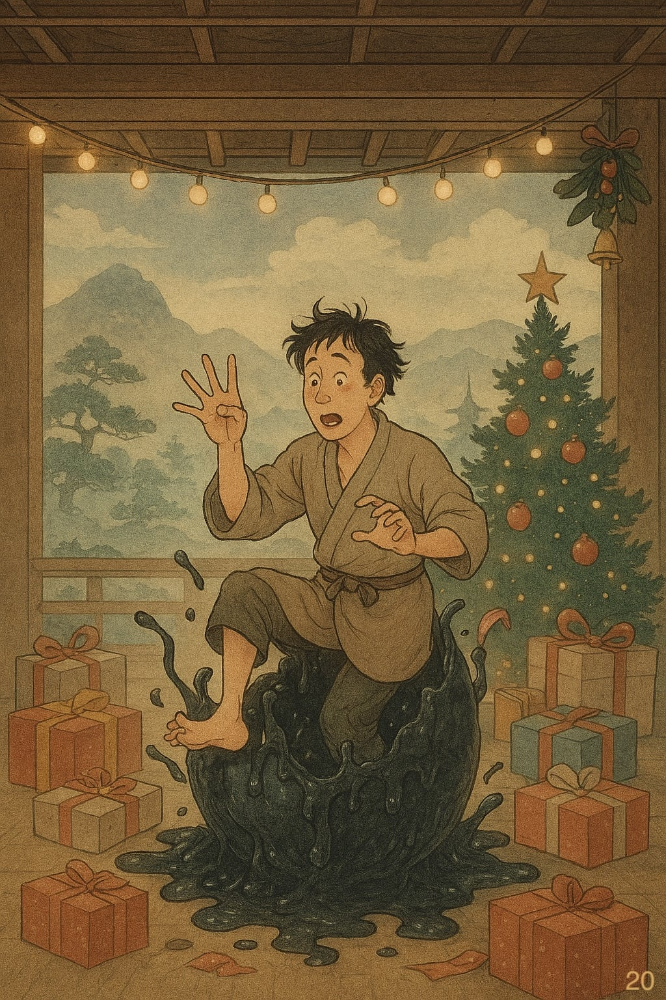

# Cose Belle & Altre Storie - Edizione #20
*Sabato 20 Dicembre 2025 - Il buongiorno del weekend*

---

## Buongiorno, esploratori!

Un'altra settimana è volata via e si avvicina il rush finale pre-ferie, con scadenze che si accumulano come particelle in un acceleratore, e quella strana sensazione di voler finire tutto mentre il cervello è già mentalmente sdraiato sul divano. Nel frattempo, ho già provveduto a spacchettare i regali che mi sono fatto da solo. Il vantaggio? Zero sorprese, coefficiente di attrito sociale ridotto al minimo, e la certezza matematica di aver preso esattamente quello che volevo.

> Patience is the best remedy for every trouble.\
> Titus Maccius Plautus

Tra poco si spacchetta qualche altro regalo (questa volta non scelto da me), si attiva ufficialmente la modalità festività, e finalmente avrò tempo per mettermi in pari con Stranger Things. Sì, avete capito bene: ho finalmente fatto l'abbonamento a Netflix. Dopo anni di resistenza, mi sono arreso all'entropia del consumismo sfrenato. Il lato positivo? Ora posso dire anche io "l'ho visto su Netflix" senza mentire.

Ma prima di abbandonarci alle feste, prendetevi un caffè (o quello che preferite), e immergiamoci in questa ventesima raccolta settimanale di scoperte, riflessioni e curiosità varie.

---

## In Questo Numero

Questa settimana esploriamo un paradosso affascinante: in un mondo che corre verso la realtà virtuale e l'intelligenza artificiale, perché siamo sempre più attratti da giradischi, Polaroid e Nokia 3310? Poi scopriremo i trucchi segreti dei food stylist (spoiler: quella pubblicità del gelato probabilmente conteneva colla vinilica), la calcolatrice Android che calcola con precisione infinita, e i misteriosi "brain rot animals" che stanno conquistando la Gen Alpha con nomi che fingono di essere italiani. Nel mezzo, Alien che dopo 46 anni rimane imbattibile, Ed Sheeran che canta mentre attorno a lui sfrecciano delle auto che sono missili, e qualche riflessione sul fatto che forse, ogni tanto, il vecchio funzionava meglio del nuovo.

---

## La Riflessione della Settimana

### In un oggi più che mai digitale, perché sogniamo giradischi e telefoni a conchiglia?

Viviamo nell'epoca più tecnologicamente avanzata della storia umana. La realtà virtuale sta diventando accessibile, i nostri frigoriferi hanno il Wi-Fi, gli smartwatch chiamano i soccorsi se cadiamo. Siamo più connessi, più efficienti, più "intelligenti" che mai.

Eppure, in mezzo a questa inarrestabile marcia verso il futuro, sta emergendo un paradosso affascinante: una crescente attrazione per la tecnologia del passato. Vinili che tornano a vendere più dei CD, Polaroid che spopola tra i teenager, Nokia 3310 *rieditato* nel 2017 in piena era smartphone. La domanda è: perché siamo così attratti dalla tecnologia di ieri in un'era definita da quella di domani?

**Il richiamo di un passato (forse mai esistito)**

Il primo motore è la nostalgia, quel desiderio struggente per un'epoca che spesso idealizziamo ben oltre la realtà. Filtri Instagram che invecchiano le foto, app come Huji e VSCO che aggiungono artificialmente le imperfezioni della pellicola. Stiamo attivamente rendendo imperfette le nostre immagini perfette, in un cortocircuito estetico che avrebbe confuso chiunque negli anni '80.

I numeri parlano chiaro: nel 2011, i vinili rappresentavano l'1,7% delle vendite di musica fisica. Entro il 2021, questa quota è schizzata al 50,4%. A metà 2022, i ricavi degli album in vinile erano cresciuti del 22%. Non è un fenomeno di nicchia: è un'inversione di rotta culturale.

**La rivincita del tatto e della materia**

C'è qualcosa di profondamente umano nel bisogno di oggetti fisici. In un'epoca in cui tutto è dematerializzato tra streaming, cloud, interazioni digitali cresce il desiderio di possedere qualcosa di tangibile. Un disco che si può sfogliare, una foto Polaroid che si può appendere al muro, un libro che pesa e profuma di carta appena stampata.

La tecnologia moderna ci ha dato l'accesso istantaneo a tutto, ma ci ha tolto il peso, la consistenza, la presenza fisica. E forse, solo forse, ci siamo resi conto che quella fisicità aveva un valore che non avevamo calcolato. Non è nostalgia: è il riconoscimento che alcune esperienze semplicemente funzionano meglio nel mondo reale.

**Il lusso di essere irraggiungibili**

La tecnologia moderna ha creato l'aspettativa di essere costantemente connessi, 24 ore su 24, 7 giorni su 7. E in risposta sta emergendo una controtendenza: il desiderio di disconnettersi. Il ritorno del "dumbphone" ne è la prova più evidente.

Ma attenzione: questo desiderio di semplicità è spesso un lusso. Non tutti possono permettersi di disconnettersi. Per la maggior parte delle persone, provare a vivere senza smartphone oggi sarebbe come provare a guidare senza GPS in una città sconosciuta (eccomi!): tecnicamente possibile, praticamente un incubo. Le banche hanno quasi chiuso gli sportelli fisici e ti costringono a usare l'app. La musica l'hai comprata su Apple Music e non hai più lettori CD. Il biglietto del treno è solo digitale. Provare a tornare indietro non è romantico: è complicato.

Io stesso mi ritrovo spesso a riesumare vecchi dispositivi, con la vaga idea di riutilizzarli. Ogni tanto mi viene voglia di abbandonare lo smartphone e tornare a un telefono che fa solo telefonate. Ma poi ricordo che devo pagare il parcheggio con l'app, controllare il conto in banca, ascoltare la musica, rispondere alle email, e la fantasia si infrange contro la realtà dei fatti. Certe comodità ormai sono troppo consolidate. Pensare di farne a meno non è più una scelta: è un'utopia (almeno per me).

**Quando il vecchio sembra più sicuro del nuovo**

C'è anche un altro fattore, meno romantico ma significativo: le preoccupazioni per la sicurezza e la privacy. Un sondaggio Deloitte del 2022 ha rilevato che più della metà dei partecipanti è preoccupata per le minacce alla cybersicurezza dei propri smartphone e dispositivi smart.

La ex vice presidente degli Stati Uniti, Kamala Harris, preferisce gli auricolari con filo a quelli wireless per motivi di sicurezza. Le auto Tesla, quando usano i sistemi di assistenza alla guida, sono state coinvolte in 273 incidenti in nove mesi secondo la National Highway Traffic Safety Administration. Forse, a volte, il vecchio non era solo più semplice: era anche più affidabile.

**Un segnale dal passato per il nostro futuro**

La rinascita della tecnologia retro non è una moda passeggera. È un fenomeno complesso guidato da nostalgia, bisogno di tangibilità, desiderio di disconnessione e crescenti preoccupazioni per sicurezza e privacy. È una negoziazione collettiva dei termini del progresso.

La vera domanda non è se torneremo al passato, ma quali lezioni di quel passato decideremo di portare con noi mentre costruiamo il domani. Perché forse, tra un fonografo di Edison del 1877 e un vinile del 2025, c'è più continuità di quanto pensiamo.

Per approfondire: [Throwback tech continues to fascinate us. Do we want an analog future?](https://edition.cnn.com/2022/12/28/us/technology-retro-nostalgia-cec)

---

## Scoperte & Curiosità

### Quello che non sapevo e ora sì

**Il cibo della pubblicità è (quasi sempre) finto**

Ecco spiegato come mai quando tornate a casa dopo aver fatto la spesa tutto sembra meno appetitoso di come lo avevate visto al supermercato. Il segreto? Il **food stylist**, il professionista che rende il cibo perfetto per i set pubblicitari usando trucchi che farebbero impallidire un prestigiatore.

Sotto le luci calde degli studi, il cibo vero si deteriora rapidamente. Quindi si ricorre a **sostanze non commestibili**: colla vinilica al posto del latte (più densa, più bianca, più fotogenica), vernice spray per simulare il cioccolato lucido, glicerina per le gocce di rugiada perfette. L'obiettivo non è la fedeltà: è evocare sensazioni tattili come la cremosità, la croccantezza, la succosità.

Se nelle scene con attori il cibo deve essere commestibile per legge, nella fotografia **table top** (quella dei primi piani da catalogo) la veridicità viene completamente sacrificata sull'altare della perfezione visiva. È un'intera disciplina basata sulla finzione artigianale e sulla manipolazione sensoriale. Benvenuti nel mondo dove il gelato è purè di patate e la birra è detersivo per piatti. La finzione non è solo nella società: è anche nel vostro hamburger pubblicitario.

Se volete saperne di più: [Per rendere il cibo fotogenico per la pubblicità ci si inventa la qualunque](https://www.ilpost.it/2025/11/26/cibo-pubblicita)

---

**La calcolatrice impossibile di Google**

Mentre voi al supermercato usate la calcolatrice del telefono per sommare i prezzi e capire se potete permettervi anche la confezione extra di biscotti (spoiler: la risposta è sempre sì, mentite a voi stessi), Google ha deciso di risolvere un problema che probabilmente non sapevate di avere.

La calcolatrice di Android è stata completamente riprogettata per superare i limiti della **virgola mobile**, quel sistema matematico che produce errori di arrotondamento quando i numeri diventano enormi o infinitesimali. Sotto la guida di Hans Boehm, il team ha implementato l'**aritmetica reale ricorsiva**: un metodo che calcola le cifre con precisione potenzialmente infinita.

Ora, la calcolatrice può risolvere correttamente operazioni come sottrarre un **googol** (10^100) da se stesso dopo aver aggiunto 1, dove altre calcolatrici fallirebbero restituendo zero. Combina logica simbolica e numeri razionali per garantire che ogni cifra sullo schermo sia matematicamente esatta. È la trasformazione di teorie accademiche astratte in uno strumento quotidiano per miliardi di utenti.

Servirà a qualcosa nella vostra vita? Probabilmente no. Ma la prossima volta che calcolate il conto del ristorante, sappiate che state usando un'applicazione che potrebbe risolvere equazioni che farebbero sudare un astrofisico. E questo, in qualche modo, è bellissimo.

Se non potete farne a meno: [The Impossible Calculator](https://asteriskmag.com/issues/10/the-impossible-calculator)

---

**Brain Rot Animals: quando l'AI incontra la Gen Alpha**

Se pensavate di aver capito cosa succede su TikTok, preparatevi a ricredervi. La **Generazione Alpha** (e i più giovani della Gen Z) stanno impazzendo per i cosiddetti **brain rot animals**: creature assurde generate dall'intelligenza artificiale con nomi che imitano scherzosamente l'italiano.

Il **Chimpanzini Bananini**. La **Ballerina Cappuccina**. L'**Anatrullolo** (sì, ce l'ho sul frigorifero, e no, non so perché). Questi meme stravaganti sono protagonisti di video virali accompagnati da narrazioni nonsenso che lasciano gli adulti completamente spiazzati.

È un fenomeno scappato di mano, alimentato dall'accessibilità degli strumenti di AI generativa. Alcuni educatori sono preoccupati per l'impatto sulla creatività dei ragazzi, altri lo vedono come un'evoluzione ludica e innocua della comunicazione online. La verità? Probabilmente nessuno lo sa davvero.

Ciò che è certo è che l'AI sta plasmando il linguaggio e l'immaginario collettivo dei giovanissimi attraverso l'ironia e la banalità. E mentre noi cerchiamo di capire, loro continuano a condividere video di animali impossibili con nomi che suonano vagamente come piatti di un ristorante italiano gestito da un algoritmo ubriaco.

Fonte: [From Chimpanzini Bananini to Ballerina Cappuccina: how gen alpha went wild for Italian brain rot animals](https://www.theguardian.com/society/2025/jun/25/from-chimpanzini-bananini-to-ballerina-cappuccina-how-gen-alpha-went-wild-for-italian-brain-rot-animals)

Ne parlavo anche nell’edizione #15. Lì vi consigliavo il [video di Yotobi](https://www.youtube.com/watch?v=ImWZBs40eKA)

---

## Intrattenimento (Mica) Banale

**Alien: 46 anni e non li dimostra**

Ho riguardato **Alien** di recente. Quel film del 1979 diretto da Ridley Scott, con lo Xenomorfo nato dalla visione disturbante di H.R. Giger e Sigourney Weaver che definisce cosa significa essere un'eroina action senza bisogno di muscoli gonfiati o battute da action hero.

Che film. Dopo 46 anni, regge ogni singolo fotogramma. La tensione, il design, il ritmo, l'uso del silenzio. È un capolavoro che non ha bisogno di spiegazioni, riconosciuto tale persino dal National Film Registry degli Stati Uniti.

E poi c'è **Alien: Earth**, la serie uscita quest’anno. Messa in scena buona, budget evidente, effetti speciali impeccabili. Peccato che la trama non abbia il minimo senso e gli episodi siano solo riempitivo travestito da sviluppo narrativo. È come se avessero preso l'estetica perfetta di Alien e l'avessero riempita con la sceneggiatura di un videogioco mobile free-to-play.

La lezione? A volte il vecchio non è meglio per nostalgia. È meglio perché era semplicemente fatto meglio.

La [Wiki di Alien](https://it.wikipedia.org/wiki/Alien) nasconde tante chicche. Leggere per credere.

---

## La Colonna Sonora

[Ed Sheeran - Drive](https://www.youtube.com/watch?v=Cf1hKtrA9lg)

Questa settimana, la colonna sonora arriva direttamente dal mondo della Formula 1. Ho rivisto **F1** (il film con Brad Pitt), e devo dire che più che delle gare si assiste a un incontro di box, visti tutti gli "incidenti accidentali" creati strategicamente da Sonny Hayes (il personaggio di Pitt). Diciamo che quest'anno in Formula 1 vera si è stati squalificati per molto, molto meno.

Ma torniamo alla musica. **Drive** di Ed Sheeran è uno di quei brani che accompagna perfettamente. La voce calda di Sheeran e la produzione pulita creano un'atmosfera che funziona sia mentre guidi davvero (metaforicamente o letteralmente) sia mentre sei fermo nel traffico a riflettere sulle scelte di vita.

È il tipo di canzone che ti fa venir voglia di metterti in macchina e andare, anche se non hai una destinazione precisa. E forse è esattamente quello di cui abbiamo bisogno in questo periodo pre-festivo: la sensazione che si possa ancora partire, anche se per ora si resta fermi.

---

## & Un'Altra Cosa

Prima di chiudere, una piccola riflessione personale. Mentre mettevo ordine nei regali auto-spacchettati (sempre una buona idea, fidatevi), mi sono reso conto che questo 2025 è stato un anno strano. Pieno di cose nuove che sembravano vecchie, vecchie cose che sembravano nuove, e la costante sensazione di essere sempre un po' in ritardo su tutto.

Ma forse è proprio questo il bello. Non dobbiamo essere sempre all'avanguardia, sempre aggiornati, sempre al passo. A volte va bene anche fermarsi, tirare fuori il vecchio giradischi (metaforico o reale), e ricordarsi che la tecnologia dovrebbe servirci, non comandarci.

E con questo pensiero, vi auguro delle ottime feste. Qualunque cosa festeggiate, comunque la festeggiate.

Importante e assolutamente non contrattabile, tra poco mancheranno **[quattro giorni a Natale.](https://www.youtube.com/watch?v=QHY3J9ghvyc)**

---

## Prima di salutarci...

E anche questa settimana è fatta! Ventesima edizione: il doppio della doppia cifra, un traguardo che suona quasi matematicamente soddisfacente. Se qualcuno mi avesse detto a luglio che avrei scritto riflessioni su giradischi nostalgici e brain rot animals nello stesso documento, probabilmente avrei riso. Eppure eccoci qui, con una raccolta che ormai ha superato le aspettative iniziali e continua a crescere.

Spero che qualcosa in questa raccolta vi accompagni piacevolmente nel weekend festivo. Se trovate qualcosa che vi incuriosisce particolarmente, o se avete scoperte da condividere (magari mentre spacchettate i vostri regali), mi farebbe davvero piacere saperlo.

Buone feste, buon sabato, e alla prossima esplorazione!

---

*PS: Questa newsletter ha come unico scopo quello di condividere curiosità e belle scoperte. Tutti i link e i contenuti sono selezionati a titolo personale e gratuito.*

---

Se sei arrivato fin qui, evidentemente qualcosa ti ha incuriosito. Bene! Puoi iscriverti per ricevere queste piccole collezioni ogni sabato (promesso, non spammo), oppure condividerle con chi secondo te potrebbe apprezzare. O entrambe le cose, che non guasta.