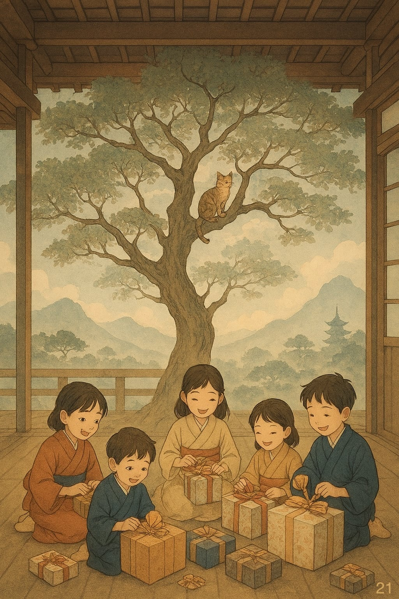
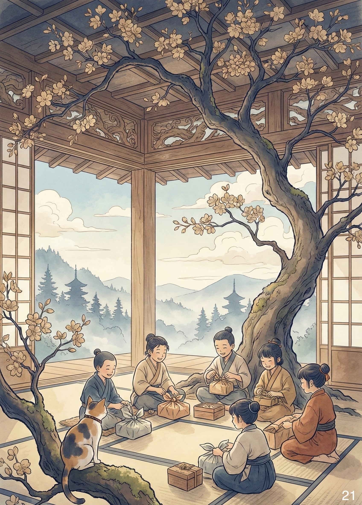

# Cose Belle & Altre Storie - Edizione #21
*Sabato 27 dicembre 2025 - Il buongiorno del weekend*

---

## Buongiorno, esploratori!

Un'altra settimana è volata via. Anzi, in questo caso dire "settimana" è un eufemismo: sono volati panettoni, regali, cenoni, buoni propositi pronunciati mezzora prima di mezzanotte già dimenticati alle 00:03. Anche questo Natale è andato, e ora ci prepariamo alla cena ipocalorica di Capodanno, quel momento dell'anno in cui fingiamo che sette giorni di carboidrati si possano compensare con un'insalata e qualche buona intenzione. 

> Example is not the main thing in influencing others. It is the only thing.
> Albert Schweitzer

Non sempre ci sono collegamenti evidenti tra un'edizione e l'altra di questa newsletter. A volte la vita è semplicemente olistica: un insieme di eventi sparsi che trovano senso nell'insieme, non nella continuità narrativa. Del resto, se l'universo tende all'entropia, perché io dovrei essere da meno?

Prendetevi un caffè (o quello che preferite), mettetevi comodi, e benvenuti nell'ultima raccolta dell'anno.

---

## In Questo Numero

Questa settimana parliamo di architettura e natura, di quando l'idea di "casa" era solo un albero sopra la testa. Scopriamo come il primo SMS della storia sia diventato (senza saperlo) una rivoluzione da 72 miliardi di messaggi all'anno. Capiamo perché il Fraser Fir domina il mercato degli alberi di Natale americani. E riflettiamo sul supplizio natalizio di chi deve sistemare i device di genitori e parenti. Ci perdiamo anche in un archivio di orari ferroviari britannici che nessuno leggerà mai, ma qualcuno ha avuto la pazienza di salvare.

---

## La Riflessione della Settimana

**Quando l'architettura era solo un albero**

Nel 1753, un gesuita francese di nome Marc-Antoine Laugier pubblicò un piccolo libro che avrebbe cambiato il modo di pensare l'architettura: l'*Essai sur l'Architecture*. L'idea centrale era semplice e radicale: tutta l'architettura, dall'edificio più grandioso alla casa più modesta, deriva da un archetipo fondamentale. La capanna primitiva.

Laugier immaginava i primi esseri umani che, per ripararsi dalla pioggia, prendono quattro alberi, li piantano in verticale, ci mettono sopra dei rami disposti a triangolo, e sopra ancora delle foglie. Ecco fatto: il primo tetto della storia. Non un muro. Non una barriera. Un filtro. Qualcosa che media tra l'uomo e la natura, che lascia passare la luce, la brezza, ma ferma la pioggia e il sole troppo forte.

L'architettura, secondo Laugier, nasce quando l'uomo utilizza elementi naturali per mediare tra le proprie necessità di comfort e il clima esterno. Il muro non è una barriera, ma un dispositivo di regolazione termica e luminosa. La casa non è una fortezza contro la natura, ma un'interfaccia.

È un'idea che suona incredibilmente moderna, no? Eppure aveva più di due secoli quando Carlo Ratti, architetto italiano, l'ha presa sul serio. Nel suo progetto *The Greenary*, una casa è stata costruita attorno a un albero vivo. Non un albero piantato nel giardino. Un albero che attraversa il pavimento, cresce dentro il soggiorno, esce dal tetto. L'architettura diventa davvero un'interfaccia: la pianta regola l'umidità, purifica l'aria, offre ombra d'estate e luce d'inverno quando perde le foglie.

Potremmo chiamarla "architettura biofilica", termine tecnico che suona bene nei convegni. Ma in realtà è solo il ritorno a un'idea vecchia quanto l'uomo: la casa non è un sistema chiuso, è un sistema aperto in equilibrio termodinamico con l'ambiente. La capanna di Laugier aveva capito tutto secoli fa, prima che inventassimo il cemento armato, il vetrocamera, l'aria condizionata centralizzata.

Il paradosso è che abbiamo impiegato 200 anni a rendere le case perfettamente ermetiche, sigillate, isolate dalla natura. E ora stiamo ri-aprendo le finestre. Letteralmente e metaforicamente. Progetti come *The Greenary* non sono un vezzo estetico: sono esperimenti su come vivere in un edificio che respira, che ha un metabolismo, che cambia con le stagioni.

C'è un movimento chiamato *One Health* che sostiene una tesi semplice: il benessere umano è inseparabile da quello delle piante e degli animali. Se applichiamo questo principio all'architettura, la casa smette di essere un bunker e diventa un ecosistema. Permeabile. Capace di modulare, adattarsi, rispondere.

Laugier, nel suo frontespizio del 1753, aveva disegnato una fanciulla (l'Architettura personificata) seduta sulle rovine di ordini classici consunti dal tempo. Con una mano indicava a un putto alato la capanna primitiva: quattro tronchi, un tetto di rami. Il messaggio era chiaro: tutta la magnificenza dell'architettura deriva da là. Dall'albero.

Forse la lezione più sottile di Laugier è questa: la tecnologia più avanzata non è quella che ci separa dalla natura, ma quella che ci aiuta a starci dentro meglio. La capanna primitiva non era primitiva per ignoranza, ma per sapienza. Sapeva che l'albero sopra la testa è tutto ciò che serve, se sai come usarlo.

E oggi, dopo aver inventato il grattacielo, il vetro autopulente, i materiali a cambiamento di fase, forse stiamo solo tornando a quella saggezza. Con qualche albero in più dentro casa, stavolta.

**Link di approfondimento:**
- [Marc-Antoine Laugier](https://it.wikipedia.org/wiki/Marc-Antoine_Laugier)
- [Essai sur l'Architecture](https://archive.org/details/surlarchitecture00laug/mode/2up)
- [Progettazione biofilica: dove innovazione e natura si incontrano](https://www.incide.it/architettura-biofilica/)
- [The Greenary, la casa intorno all’albero di Carlo Ratti per Mutti](https://www.matrix4design.com/it/architettura/the-greenary-la-casa-intorno-allalbero-di-carlo-ratti-per-mutti/)

---

## Scoperte & Curiosità 

### Quello che non sapevo e ora sì

**Il primo SMS compie 33 anni (e nessuno lo aveva capito)**

Il 3 dicembre 1992, alle 18:09 ora inglese, un ingegnere britannico di 22 anni di nome Neil Papworth inviò da un computer un messaggio di due parole a un telefono cellulare Orbitel 901: "Merry Christmas".

Non ricevette risposta. Non poteva: i telefoni dell'epoca non avevano tastiere per scrivere. Era un test tecnico per vedere se si poteva sfruttare il canale secondario della rete GSM, quello usato per i segnali di servizio, per mandare brevi messaggi di testo. L'idea iniziale? Creare un servizio di cercapersone. Nessuno immaginava cosa sarebbe successo.

Nel 2012, vent'anni dopo, l'Italia raggiunse il picco storico: 72,2 miliardi di SMS inviati in un anno. Poi arrivò WhatsApp, e in cinque anni il numero crollò del 75%. Oggi riceviamo SMS praticamente solo dalla banca (codici 2FA), dai corrieri, e da quei servizi che ancora non si fidano delle app.

Ma negli anni d'oro, gli SMS hanno fatto qualcosa di straordinario: hanno creato un nuovo linguaggio. "CMQ", "TVB", "Xké", emoticon con i due punti e la parentesi :), frasi spezzate in più messaggi perché 160 caratteri non bastavano mai. Twitter all'inizio era nato come servizio per mandare SMS collettivi: il limite di 140 caratteri non era casuale, era il massimo che si poteva scrivere lasciando spazio al nome utente.

Neil Papworth ha raccontato che per anni non ha detto nemmeno ai suoi figli di aver fatto la storia. Pensava fosse un episodio marginale. Solo quando ha visto miliardi di persone abbreviare parole, inventare emoji, comunicare senza mai chiamare, ha capito che quel "Merry Christmas" inviato da un computer aveva cambiato tutto.

Nel 2021 qualcuno ha comprato una copia digitale di quel primo SMS come NFT. Prezzo: 132.000 euro. Donati in beneficenza, per fortuna.

Trentatré anni dopo il primo messaggio, gli SMS sono quasi estinti. Ma il loro DNA è ovunque: ogni chat, ogni app di messaggistica, ogni notifica push è figlia di quelle due parole inviate senza aspettarsi risposta.

**Fonti:**
- [Neil Papworth](https://neilpapworth.com/)
- [BBC News - Text messages turn 10](http://news.bbc.co.uk/2/hi/uk_news/2538083.stm)

---

### L'infografica che vale la pena

**Il dato che non ti aspetti**

Nel 2023, gli Stati Uniti hanno venduto 21,6 milioni di alberi di Natale veri. Non artificiali, veri: tagliati, trasportati, venduti, decorati, e poi (ahinoi) buttati o riciclati a gennaio.

Il Fraser Fir, una conifera che cresce principalmente in North Carolina, domina il mercato. Perché? Semplice: non perde gli aghi. Puoi tenerlo in casa per sei settimane e non cade una sola foglia. Per un albero destinato a stare in soggiorno con sotto regali da centinaia di euro, questa è una caratteristica non negoziabile...

Il mercato degli alberi di Natale USA vale 1,4 miliardi di dollari e ha vissuto anni drammatici. Dal 2020 al 2023 c'è stata una carenza cronica: la pandemia aveva fatto esplodere la domanda (tutti a casa = tutti con l'albero), ma gli alberi impiegano 7-10 anni a crescere.

A complicare le cose, nel 2024 l'uragano Helene ha devastato le coltivazioni in North Carolina. Frane, allagamenti, alberi spazzati via. Eppure, grazie a decenni di investimenti in coltivazioni distribuite (Michigan, Pennsylvania, Wisconsin), il mercato ha retto.

Esiste persino un progetto scientifico chiamato CoFirGE (*Collaborative Fir Germplasm Evaluation Project*) che cerca di identificare nuove specie di abeti resistenti al marciume radicale, una malattia causata da una muffa d'acqua chiamata *Phytophthora* che può uccidere un albero in pochi giorni. Immaginate di decorare il Fraser Fir la sera, e il giorno dopo trovarlo appassito. Dramma natalizio assoluto.

Il dato più affascinante? Circa il 25% degli alberi venduti in USA viene tagliato direttamente dal cliente nelle "fattorie di taglio". Famiglie che vanno con la sega, scelgono l'albero, lo abbattono, se lo portano a casa. È un rito. Molto americano. Molto lontano dall'albero di plastica montato in 3 minuti con le istruzioni IKEA.

E noi europei? Beh, noi abbiamo i mercatini di Natale e il vin brulé. Loro hanno la motosega in famiglia e il Fraser Fir per sei settimane. A ciascuno il suo Natale.

**Fonte:** [Infografica Voronoi - Mercato alberi di Natale USA 2023](https://www.voronoiapp.com/_next/image?url=https%3A%2F%2Fcdn.voronoiapp.com%2Fpublic%2Fimages%2Fpreview_010e0fa0-5af7-446c-8a7a-9cb386f2c5f1.webp&w=1920&q=85)

---

### La lettura intelligente

**La lettura che colpisce nel segno**

C'è un rito natalizio che unisce generazioni, ma non nel modo che ci si aspetta. Non sto parlando del cenone o dello scambio di regali. Parlo del momento in cui tua madre ti chiama perché "il computer non funziona" e tu scopri che in realtà ha dimenticato la password dell'email. Di nuovo. Per la quinta volta quest'anno.

Il Post ha pubblicato un articolo che descrive con ironia chirurgica questa dinamica: il ritorno a casa per le feste si trasforma in un servizio di assistenza tecnica improvvisato. Password di Amazon smarrite, SPID bloccati, smartphone con 47 notifiche non lette e la certezza che "una volta funzionava". Il divario generazionale tra chi ha una visione analogica del mondo e chi deve gestire il caos digitale dei propri cari diventa evidente quando ti ritrovi a spiegare per la terza volta che no, Facebook e Google non sono la stessa cosa.

L'autrice suggerisce che questa assistenza sia una forma moderna di accudimento filiale. Un tacito compromesso: io ti recupero la password di Netflix, tu mi fai mangiare per una settimana senza dover cucinare. È frustrante, certo. Richiede una pazienza che pensavi di non avere. Ma è anche, paradossalmente, un momento di vicinanza forzata.

La tecnologia dovrebbe semplificare la vita. Invece, a volte, diventa il pretesto per passare mezz'ora seduti vicino a tua madre mentre le spieghi che sì, la password deve avere almeno 8 caratteri, una maiuscola, un numero e qualche altro carattere che nemmeno sapevi di avere a disposizione.

Suona familiare? Ecco, non siete soli.

**Fonte:** [Il Post - Il supplizio natalizio delle password degli anziani](https://www.ilpost.it/2025/12/24/mastruzzo-il-supplizio-natalizio-delle-password-degli-anziani/?homepagePosition=16)

---

## La Colonna Sonora

**Ella Fitzgerald - Rudolph The Red-Nosed Reindeer**

Questa settimana la colonna sonora è d'obbligo: Rudolph, la renna dal naso rosso. Non una versione qualsiasi, ma quella di Ella Fitzgerald, registrata nel 1960 per l'album *Ella Wishes You a Swinging Christmas*.

L'ho ascoltata proprio la sera di Natale. C'è qualcosa di perfetto in Ella che canta di una renna: la voce è calda, swing, ironica al punto giusto. Trasforma una canzone per bambini in jazz sofisticato senza perdere un grammo di leggerezza.

Rudolph, tra l'altro, è stato inventato nel 1939 da Robert L. May, copywriter di Montgomery Ward, per una campagna di marketing. La canzone è arrivata dieci anni dopo. E oggi? Il naso rosso di Rudolph è così iconico che persino i radar militari potrebbero usarlo come "firma termica" per tracciare Babbo Natale. Se solo fosse vero.

Da jingle pubblicitario a simbolo natalizio globale. Non male per una renna immaginaria.

**Ascolta qui:** [Ella Fitzgerald - Rudolph The Red-Nosed Reindeer](https://www.youtube.com/watch?v=Pc5i3_7_u9w)

---

## & Un'Altra Cosa

### L'Internet Archive dei documenti di trasporto britannici

Se vi piacciono gli orari ferroviari del 1987 o i biglietti degli autobus di Londra del 1992, esiste un angolo di Internet fatto apposta per voi: [UK Bus & Train Documents](https://archive.org/details/uk-bus-train-documents) su Internet Archive.

È una collezione di PDF scansionati: orari, mappe di rete, depliant informativi, documenti tecnici. Tutto materiale che nessuno si sognerebbe di conservare, ma che qualcuno ha avuto la pazienza di digitalizzare.

Perché è affascinante? Perché ogni documento racconta com'era viaggiare prima di Google Maps, prima delle app in tempo reale, quando sapere se il bus delle 17:23 passava davvero alle 17:23 era questione di fede e di un foglio di carta piegato in quattro.

C'è anche qualcosa di malinconico: sfogliare un orario ferroviario del 1995 ti fa capire quanto sia cambiato il mondo. Non solo la tecnologia, ma proprio il concetto di pianificazione. Oggi non "consultiamo" orari: guardiamo dove si trova il bus in tempo reale. È comodissimo. Ma forse abbiamo perso qualcosa: la capacità di fidarci di un pezzo di carta.

O forse no. Forse è solo nostalgia. Ma intanto, se volete, potete perdervi in questa collezione. È incredibilmente rilassante.

**Esplora qui:** [UK Bus & Train Documents - Internet Archive](https://archive.org/details/uk-bus-train-documents)

---

### Una nota sulle copertine (o: quando tradisci OpenAI per una banana)

Da quando ho iniziato questa newsletter, ogni edizione ha la sua copertina generata con intelligenza artificiale. Finora ho usato OpenAI, con risultati generalmente buoni ma non sempre entusiasmanti. Questa settimana ho fatto un esperimento: ho generato la stessa immagine con due modelli diversi, usando lo stesso identico prompt.

Il primo è il solito DALL-E di OpenAI. Il secondo si chiama Nano Banana Pro (di Google). Sì, avete letto bene: Nano Banana Pro. Un nome che suona come un frullato proteico venduto nei centri fitness o come un gadget tech che trovi nei marketplace cinesi tra cavi USB e powerbank da 50.000 mAh. Eppure, nonostante il nome improbabile, il risultato mi ha convinto.

La qualità è oggettivamente migliore: dettagli più definiti, composizione più equilibrata, uno stile grafico che mi aggrada molto di più. Sembra quasi che il modello sappia cosa vuole comunicare, mentre OpenAI a volte sembra tirare a indovinare. Per questa ultima edizione dell'anno le vedrete entrambe, così potete giudicare con i vostri occhi. Dalla prossima, però, passerò definitivamente al nuovo modello.

Non pensavo che il 2025 si sarebbe chiuso con me che abbandono un colosso dell'AI per un modello che si chiama come un frutto tropicale miniaturizzato. Ma qui siamo: cambio d'anno, cambio di modello. La vita è piena di sorprese.

---

## Prima di salutarci...

E anche questa settimana è fatta! Anzi, anche quest'anno è quasi fatto. La newsletter, continuerà con il nuovo anno, settimana dopo settimana, senza un motivo particolarmente nobile, solo perché ogni sabato c'è qualcosa di interessante da condividere.

Se siete arrivati fin qui, grazie. Di cuore. Che siate lettori della prima ora o nuovi arrivati, sappiate che ogni volta che apro la mail e vedo che qualcuno ha letto, cliccato (molto pochi), risposto, mi ricordo perché vale la pena continuare.

Ci vediamo nel 2026. Buon anno nuovo, e alla prossima esplorazione.

---

*PS: Questa newsletter ha come unico scopo quello di condividere curiosità e belle scoperte. Tutti i link e i contenuti sono selezionati a titolo personale e gratuito.*

Se sei arrivato fin qui, evidentemente qualcosa ti ha incuriosito. Bene! Puoi iscriverti per ricevere queste piccole collezioni ogni sabato (promesso, non spammo), oppure condividerle con chi secondo te potrebbe apprezzare. O entrambe le cose, che non guasta.