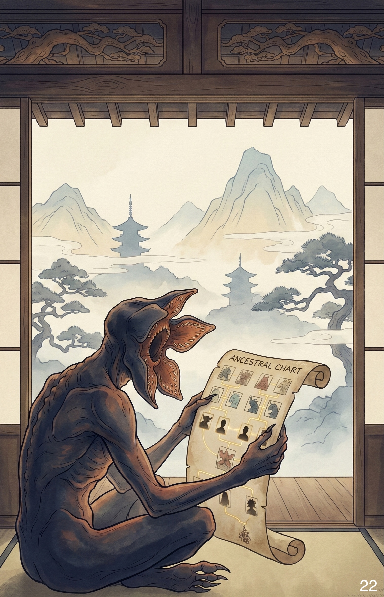

# Cose Belle & Altre Storie - Edizione #22
*Sabato 3 Gennaio 2026 - Il buongiorno del weekend*

---

## Buongiorno, esploratori!

Un'altra settimana è volata via, e come ogni sabato mattina è il momento di fare il punto: cosa mi ha colpito, cosa vale la pena condividere, cosa merita di essere raccontato. Sette giorni di internet, libri, conversazioni e scoperte varie che ho raccolto per voi in 10 minuti (circa) di lettura.

Il 2025 ci ha salutato esattamente come ci aveva accolto: freddo, nebbia, pioggia. Un ciclo meteorologico che ricorda i sistemi periodici in fisica, dove le condizioni iniziali determinano l'intero comportamento futuro. La differenza? Quest'anno arrivano finalmente le ferie, quel momento in cui il sistema può finalmente raggiungere uno stato di minima energia. Tra una giornata grigia e l'altra, ho chiuso anche l'ultima stagione di Stranger Things. Spoiler: la delusione è stata quantificabile con precisione cronometrica.

> Life is like arriving late for a movie, having to figure out what was going on without bothering everybody with a lot of questions, and then being unexpectedly called away before you find out how it ends.
> Joseph Campbell

Prendetevi un caffè (o quello che preferite), e via con questa prima esplorazione del 2026.

---

## In Questo Numero

Questa settimana riflettiamo sulla fisica narrativa e su come la plot armor violi le leggi fondamentali della probabilità. C'è Stranger Things che conclude cinque stagioni in cinque minuti, tecnologia che trasforma il mondo fisico in digitale con quadratini pixelati, e la rete genealogica più intricata del mondo magico. Più: la mappa completa di internet che spiega perché ridete sempre delle stesse cose, e la conferma che smettere di guardare gente ballare è fisicamente impossibile. Andiamo.

---

## La Riflessione della Settimana

**La termodinamica della plot armor: quando i demogorgoni dimenticano la fisica**

C'è un momento preciso in cui una serie TV attraversa l'orizzonte degli eventi narrativo: quel punto di non ritorno dove le leggi della fisica, della logica e del buonsenso smettono di applicarsi. Stranger Things ha raggiunto questo punto nella sua quinta e ultima stagione, e l'ha fatto con una precisione quasi scientifica: esattamente 5 minuti di battaglia finale. Cronometro alla mano.

Lasciamo perdere i demogorgoni che stendono chiunque non faccia parte della "famiglia" al primo sguardo, ma si lasciano abbattere con un calcio ben assestato se sei nel cast principale. Ignoriamo il fatto che percorrere chilometri con in braccio qualcuno che pesa quanto te, dopo giorni senza cibo né riposo, dovrebbe portare al collasso da acido lattico ben prima dell'incontro con il Mind Flayer. E stendiamo un velo pietoso sull'assenza totale di demogorgoni a guardia del boss finale, come se nel Sottosopra non esistesse il concetto di sicurezza perimetrale.

Il vero problema è la termodinamica narrativa.

**L'entropia della credibilità**

In fisica, l'entropia misura il disordine di un sistema. Più passa il tempo, più aumenta. In una narrazione televisiva, funziona esattamente al contrario: più stagioni accumuli, più dovresti aumentare la coerenza interna, non diminuirla. Stranger Things ha invertito questa legge fondamentale.

La quinta stagione presenta quello che gli sceneggiatori devono aver pensato fosse un climax epico: Vecna e il Mind Flayer, i due antagonisti più potenti della serie, sconfitti con:
- qualche migliaio di granelli di sabbia
- alcune centinaia di proiettili
- una manciata di fiammiferi
- calci nelle palle q.b.

Tempo totale dell'operazione: 5 minuti. Cinque.

Per contestualizzare: ci sono volute quattro stagioni intere per arrivarci.  Ore di preparazione, addestramento, perdite, sacrifici (pochi e perlopiù irrilevanti). E poi tutto si risolve nel tempo che serve per preparare un caffè espresso, spesso anche male.

**La plot armor come violazione delle probabilità**

La plot armor (quella forza invisibile che protegge i protagonisti dalle conseguenze logiche delle loro azioni) non è un concetto nuovo nelle narrazioni. È antico quanto le storie stesse. Ma c'è una differenza sottile tra "fortuna narrativa credibile" e "violazione sistematica delle leggi di probabilità".

Prendiamo un esempio concreto: un demogorgone ha un tasso di successo del 100% contro i personaggi secondari (o terziari). Appare, attacca, uccide. Contro i protagonisti? Circa il 2%. Statisticamente, se fossimo in un universo con leggi probabilistiche costanti, dopo cinque stagioni la famiglia Byers dovrebbe essere estinta tre volte.

Il problema non è che i protagonisti sopravvivano. È che la serie ha smesso di fingere che ci sia una ragione per cui sopravvivono, oltre al fatto che sono nel cast principale. Il Sottosopra ha sviluppato un sistema di riconoscimento facciale selettivo: "Ah, tu sei Eleven? Passa pure. Tu sei un tizio a caso? Morte istantanea."

**Aspettative tradite e la psicologia della delusione**

Sapevo che il finale mi avrebbe deluso. Lo sapevo. Eppure ho guardato fino all'ultimo frame, come un fisico che osserva un esperimento di cui conosce già l'esito ma spera segretamente in una violazione delle leggi naturali.

Continuiamo a investire tempo ed emozioni in narrazioni che sappiamo ci deluderanno, perché la speranza che "forse questa volta sarà diverso" pesa più della razionalità. È lo stesso meccanismo che fa comprare biglietti della lotteria a persone che conoscono perfettamente le probabilità (assurdamente basse) di vincita.

La delusione non arriva dal fatto che il finale sia cattivo in sé. Arriva dal tradimento delle aspettative costruite in cinque stagioni. Come se giocassi a scacchi per ore, sviluppando strategie complesse, e poi all'improvviso l'avversario rovesciasse la scacchiera e dichiarasse di aver vinto perché "così dicono le regole".

**Cosa resta quando finisce il gioco**

Forse il vero finale di Stranger Things non sono quei 5 minuti concitati. Forse è il momento in cui spegni lo schermo e realizzi che hai passato anni a seguire una storia che non aveva intenzione di rispettare il contratto narrativo che aveva stipulato con te fin dalla prima scena del primo episodio.

E la domanda che resta è: valeva comunque la pena? Probabilmente sì. Non per il finale, ma per il viaggio. Per le prime due stagioni magnifiche, per i personaggi che hanno funzionato, per le atmosfere che hanno catturato qualcosa di autentico degli anni '80 (anche se non li ho vissuti, se non tramite il cinema).

Ma la prossima volta che qualcuno mi chiederà se consiglio la serie, la mia risposta includerà un disclaimer termodinamico: "Guardala, ma sappi che l'entropia narrativa aumenta inesorabilmente dopo la stagione due. Le leggi della fisica del Sottosopra sono più stabili della coerenza della sceneggiatura."

Almeno i demogorgoni non tradiscono mai: fanno esattamente quello che il copione dice di fare. È più di quanto si possa dire degli sceneggiatori...

Fonte: Stranger Things lo puoi guardare su Netflix.

---

## Scoperte & Curiosità

### Quello che non sapevo e ora sì

**Know Your Meme: l'enciclopedia di quando internet fa ridere**

Ogni tanto vi capita di ridere di un meme senza sapere perché è nato, cosa significa, o da dove viene? Know Your Meme è la risposta a tutte queste domande che non sapevate di avere.

È un archivio storico che documenta fenomeni virali, tendenze emergenti e sottoculture digitali con la serietà di un'enciclopedia accademica applicata a contenuti profondamente non seri. Ogni meme ha la sua pagina con origini, evoluzione, varianti, e contesto sociale.

Oltre alle definizioni, il sito pubblica editoriali e interviste che aiutano a decodificare il linguaggio digitale. Perché ridete sempre di quella specifica immagine modificata mille volte? Qual è il substrato culturale dietro quel video assurdo che ha fatto il giro del mondo?

Il sito monitora costantemente l'evoluzione dell'umorismo online attraverso classifiche annuali e sezioni news. È l'equivalente digitale di avere un antropologo personale che ti spiega perché tutti stanno ridendo della stessa cosa.

Warning: entrare su Know Your Meme con l'intenzione di "dare un'occhiata veloce" è come aprire Wikipedia alle 23:00. Ci rivediamo a Pasqua.

Link: [Know Your Meme](https://knowyourmeme.com/)

---

### L'albero genealogico che vale la pena

**L'albero genealogico completo di Harry Potter: quando tutti sono cugini**

Qualcuno su Reddit ha fatto quello che probabilmente J.K. Rowling si è sempre rifiutata di fare: mappare TUTTE le connessioni di sangue nel mondo magico. Il risultato è un albero genealogico che dimostra una verità scomoda: praticamente tutte le famiglie magiche sono imparentate.

I Black sono collegati ai Lestrange, che sono collegati ai Potter, che discendono dai Peverell, e via dicendo in una rete sociale che farebbe sembrare i Borgia una famiglia normale. Il grafico include anche personaggi da Animali Fantastici, rivelando connessioni attraversano secoli.

Nel mondo magico, l'albero genealogico non è un albero. È una rete intricata dove ogni ramo alla fine si ricollega a tutti gli altri.

Link: [Albero genealogico Harry Potter - Reddit](https://www.reddit.com/media?url=https%3A%2F%2Fexternal-preview.redd.it%2FXF5XpuMTActoE7SGz1J7nX2wl0X9-QkUi3BhB_0G_jE.png%3Fauto%3Dwebp%26s%3Dd237f33926ecd716d6a7400f83fadc3c8fb45c6d)

---

### La lettura intelligente

**QR Codes: la porta invisibile tra atomi e bit**

Siamo circondati da piccoli quadrati pixelati che trasformano il mondo fisico in quello digitale. Eppure, quanti di noi sanno davvero come funzionano i QR Code?

Nati in Giappone nel 1994 per tracciare componenti automotive nella fabbrica Denso Wave, questi "Quick Response" codes hanno fatto un viaggio affascinante: da strumento industriale a ponte quotidiano tra il mondo analogico e quello virtuale. La loro vera forza sta nella ridondanza: possono essere letti da qualsiasi angolazione e funzionano anche se parzialmente danneggiati grazie alla correzione degli errori Reed-Solomon (lo stesso algoritmo che salva i CD graffiati).

Esistono in due forme: statici (informazioni permanenti codificate direttamente nei pixel) e dinamici (che contengono solo un URL redirect, permettendo di cambiare il contenuto senza ristampare il codice). Quest'ultima versione è quella che ha conquistato ristorazione, marketing e logistica: puoi aggiornare un menu senza cambiare il codice sul tavolo.

La parte affascinante? I pattern di posizione (quei tre quadrati agli angoli) sono come coordinate cosmiche: dicono allo scanner "questo è un QR code" e "questa è l'orientazione corretta". Il resto è pura matematica e teoria dell'informazione condensata in millimetri quadrati.

Link: [Come funzionano i QR Codes](https://qrcodekit.com/guides/how-qr-codes-work/)

---

## Intrattenimento (Mica) Banale

**Quando smettere di guardare è fisicamente impossibile**

Gli shorts di YouTube possono nuocere gravemente alla salute mentale. Lo sappiamo tutti. Il formato breve, il loop infinito, il prossimo video che parte automaticamente prima ancora che tu decida se vuoi guardarlo. Ma poi c'è quella categoria specifica di shorts che è impossibile non guardare: gente che balla.

Ricordate qualche settimana fa, nell'edizione #15, quando vi parlavo di quel video di improvvisazione al ballo dove "c'è qualcosa di profondamente umano nel riconoscimento condiviso della bellezza improvvisata"? Ecco, questo è il fratello minore di quel momento. Stessa magia, formato condensato.

Non c'è narrazione, non c'è contesto. Solo movimento, ritmo, e quella sensazione immediata di "wow, okay, questo è impressionante". È come vedere qualcuno che padroneggia completamente il proprio corpo in sincronia con la musica. Ipnotico nel senso letterale del termine.

Il problema? Una volta che inizi, YouTube capisce che ti piace questo genere e ti sommerge. Il loop è inevitabile. Ma almeno, se devi cadere in un rabbit hole di shorts, meglio questo che le compilation di fail (di cui sono un estimatore) o i "life hacks" discutibili.

Guardatelo. Poi ditemi se siete riusciti a fermarvi al primo.

Link: [The way they move](https://www.youtube.com/shorts/fbebmOlPbao?feature=share)

---

## La Colonna Sonora

[Hi-Diddle-Dee-Dee - Pinocchio](https://www.youtube.com/watch?v=HKCfDhaDgVw)

Questa settimana il brano che non mi esce dalla testa viene da un posto inaspettato: Pinocchio. Nello specifico, "Hi-Diddle-Dee-Dee (An Actor's Life For Me)", la canzone che il Gatto e la Volpe cantano per convincere Pinocchio a diventare attore.

È una di quelle melodie apparentemente innocenti che nascondono qualcosa di più oscuro. Il testo parla di fama, successo facile, e gloria (tutto mentre i due truffatori stanno letteralmente vendendo un bambino di legno alla schiavitù circense). La cheerfulness del brano contrasta perfettamente con l'inganno che sta avvenendo.

Ma tolto il contesto narrativo, resta una canzone dannatamente orecchiabile. Quel tipo di motivetto anni '40 che entra nel cervello e si rifiuta di uscire. La voce di Walter Catlett (la Volpe) ha quel timbro teatrale perfetto, e il ritmo swing ti fa muovere la testa anche mentre stai facendo altro.

L'ho fischiettata per casa così a caso, e ora è su repeat. Se vi capita di canticchiarla sotto la doccia nei prossimi giorni, non dite che non vi avevo avvertito.

---

## & Un'Altra Cosa

Prima di salutarci, una domanda aperta: quante volte vi è capitato di investire tempo ed emozioni in qualcosa, qualsiasi cosa, sapendo già che probabilmente vi avrebbe deluso?

È curioso come continuiamo a farlo. Come se la speranza pesasse più della razionalità. Come se il viaggio, in qualche modo, giustificasse la destinazione deludente.

Forse è questa la vera plot armor: non quella dei personaggi nelle storie, ma la nostra. Quella protezione invisibile che ci permette di continuare a investire in narrazioni, relazioni, idee, anche quando i segnali ci dicono che forse dovremmo smettere e cambiare direzione.

O forse semplicemente ci piace il viaggio più della meta. E va bene così.

---

## Prima di salutarci...

E anche questa settimana è fatta! La prima del 2026, per la precisione. Ventidue edizioni alle spalle, e ancora mi stupisco di quanto internet riesca a essere contemporaneamente affascinante e frustrante.

Se qualcosa in questa raccolta vi ha fatto sorridere, riflettere, o semplicemente vi ha tenuto compagnia per qualche minuto, il sabato mattina è iniziato bene. Se invece vi ho fatto venir voglia di riguardare Stranger Things con il cronometro solo per verificare, beh, chiedo scusa in anticipo.

Buon sabato, e alla prossima esplorazione!

---

*PS: Questa newsletter ha come unico scopo quello di condividere curiosità e belle scoperte. Tutti i link e i contenuti sono selezionati a titolo personale e gratuito.*

Se sei arrivato fin qui, evidentemente qualcosa ti ha incuriosito. Bene! Puoi iscriverti per ricevere queste piccole collezioni ogni sabato mattina, oppure condividerle con chi secondo te potrebbe apprezzare. O entrambe le cose, che non guasta.