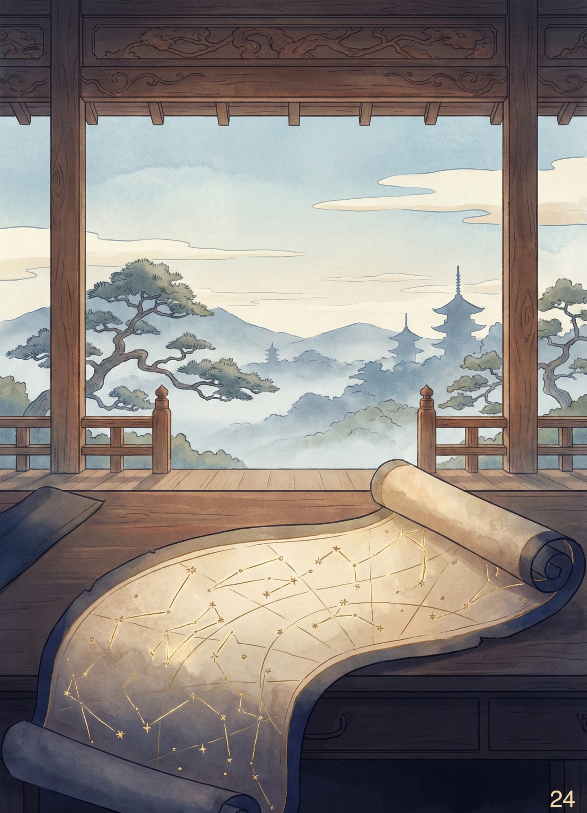

# Cose Belle & Altre Storie - Edizione #24
*Sabato 17 Gennaio 2026 - Il buongiorno del weekend*

---

## Buongiorno, esploratori!

Un'altra settimana è volata via, e come ogni sabato mattina è il momento di fare il punto: cosa mi ha colpito, cosa vale la pena condividere, cosa merita di essere raccontato. Sette giorni di internet, libri, conversazioni e scoperte varie che ho raccolto per voi in 10 minuti (circa) di lettura.

> Take what you can use and let the rest go by.\
> Ken Kesey

La prima settimana completa di lavoro dopo le ferie è passata, e il mio ritmo circadiano sta ancora cercando di capire se deve comportarsi da persona funzionante o da creatura notturna. Fare le ore piccole quasi ogni notte durante le vacanze sembrava un'ottima idea, fino a quando la sveglia delle sette non ha iniziato a suonare come un insulto personale. Il meteo grigio non aiuta: sembra che gennaio abbia deciso di interpretare il ruolo del mese più deprimente con impegno e dedizione.

Ma anche così, qualcosa di interessante da condividere c'è sempre.

Prendetevi un caffè (o quello che preferite), e via con questa nuova esplorazione.

---

## In Questo Numero

Questa settimana ci spingiamo ai confini dell'universo conosciuto, letteralmente. C'è un libro che mi ha fatto riflettere sul buio tra le stelle e su quanto poco sappiamo di ciò che compone il cosmo. Poi una serie TV che Netflix ha cancellato prima che potesse deludermi (e a questo punto lo considero un favore), una masterclass di Barbero che vale più di qualsiasi laurea in storia, e la scoperta che probabilmente usiamo il gerundio in modo sbagliato da sempre. Andiamo.

---

## La Riflessione della Settimana

**Quando il 95% dell'universo decide di non farsi vedere**

Nel 1823, l'astronomo tedesco Heinrich Wilhelm Olbers si pose una domanda apparentemente banale: perché il cielo notturno è buio? Se l'universo fosse infinito, eterno e pieno di stelle distribuite uniformemente, ogni linea di vista dovrebbe prima o poi incontrare una stella. Il cielo notturno dovrebbe essere accecante, non buio.

Il fatto che non lo sia è stato il primo indizio che l'universo non è quello che sembra.

Ho finito di leggere "Il buio oltre le stelle" di Amedeo Balbi, un saggio divulgativo che esplora i misteri della cosmologia moderna con la stessa capacità di rendere accessibile il complesso che avevo apprezzato nei suoi video. Balbi parte proprio dal paradosso di Olbers per costruire un viaggio attraverso ciò che non vediamo: materia oscura, energia oscura, orizzonti cosmici che si spostano continuamente.

La risposta al paradosso del cielo buio, tra l'altro, fu intuita da qualcuno che non ti aspetteresti: Edgar Allan Poe. Nel 1848, nel suo saggio "Eureka", Poe suggerì che il buio notturno fosse la prova che la luce delle stelle non aveva avuto tempo infinito per raggiungerci. L'universo doveva avere un'origine, un inizio preciso nel passato. Uno scrittore di racconti horror aveva capito qualcosa di cosmologia che molti scienziati suoi contemporanei non vedevano.

**Quando le mappe smettono di funzionare**

Qualche edizione fa, nell'edizione #12, avevo scritto del concetto di "mappa e territorio": l'idea che i nostri modelli mentali siano sempre approssimazioni della realtà, utili ma incompleti. Ecco, leggendo questo libro ho realizzato che la cosmologia moderna è forse l'esempio più estremo di questo principio.

Pensiamoci: secondo i calcoli attuali, la materia "normale" che conosciamo, quella fatta di atomi, quella di cui siamo composti noi, le stelle, i pianeti, tutto ciò che vediamo, rappresenta appena il 5% dell'universo. Il restante 95% è diviso tra materia oscura (circa 27%) ed energia oscura (circa 68%). Due cose che non abbiamo mai visto direttamente, che non sappiamo cosa siano, ma che devono esistere perché altrimenti i nostri modelli non funzionano.

È come se avessimo costruito una mappa dettagliatissima di un territorio, per poi scoprire che quella mappa copre solo il 5% del paesaggio reale. Il resto è terra incognita, con un cartello che dice "Qui ci dovrebbe essere qualcosa, ma non sappiamo cosa".

**L'orizzonte che si sposta**

C'è un concetto nel libro che mi ha colpito particolarmente: la "fotosfera cosmica". È un limite estremo oltre il quale l'opacità del plasma primordiale nasconde per sempre il Big Bang ai nostri sguardi elettromagnetici. Non importa quanto potenti diventeranno i nostri telescopi: c'è una barriera fisica, un muro di luce oltre il quale non potremo mai vedere con strumenti che usano la radiazione elettromagnetica.

Ma ecco la parte interessante: questo orizzonte si sposta. Non perché l'universo cambi, ma perché cambiano i nostri strumenti. Quando abbiamo inventato i radiotelescopi, abbiamo "visto" la radiazione cosmica di fondo, quel rumore di sottofondo che si sentiva persino nelle vecchie TV analogiche come interferenza. Quando useremo le onde gravitazionali come strumento di osservazione, vedremo oltre barriere che oggi sembrano invalicabili.

> L'immaginazione ci porterà spesso in mondi che non sono mai esistiti. Ma senza di essa, non andiamo da nessuna parte.
> Carl Sagan

**La strana posizione di essere marginali**

Forse l'insight più disturbante del libro riguarda la nostra marginalità biologica. Non siamo fatti della stessa materia che compone la maggior parte dell'universo. Siamo costruiti con un tipo di atomi che, nel grande schema cosmico, è decisamente scarso, praticamente un errore di arrotondamento nella contabilità universale.

È una versione aggiornata della rivoluzione copernicana: non solo non siamo al centro dell'universo, ma siamo fatti di roba rara. Siamo eccezioni in un cosmo dominato da qualcosa che non possiamo vedere, toccare, o comprendere davvero.

Eppure, eccoci qui a guardare il cielo buio e a chiederci perché è buio. E nel porci quella domanda, abbiamo scoperto che il buio stesso è una risposta: l'universo ha avuto un inizio, ha una forma, ha una storia. Una storia che per il 95% resta da scrivere.

Non male, per delle creature fatte di materiale di scarto cosmico.

**Link di approfondimento**
- [Amedeo Balbi - Il buio oltre le stelle](https://www.kobo.com/it/it/ebook/il-buio-oltre-le-stelle-l-esplorazione-dei-lati-oscuri-dell-universo?sId=36b4c935-ae59-416d-a5e7-a27d39765ae6&ssId=jTysZDSyOoCOuBAQBj8SP&cPos=1)
- [Il paradosso di Olbers](https://it.wikipedia.org/wiki/Paradosso_di_Olbers)

---

## Scoperte & Curiosità

### Il video che vale la pena

**KAOS: quando Netflix cancella prima che possa deluderti**

Ho divorato KAOS in un paio di giorni. Jeff Goldblum che interpreta Zeus come un dittatore narcisista e paranoico, una rivisitazione della mitologia greca che riesce a essere irriverente e profonda allo stesso tempo, una produzione visivamente spettacolare.

E poi Netflix l'ha cancellata dopo una sola stagione.

Ora, se ricordate l'edizione #22, avevo scritto della mia delusione cosmica per il finale di Stranger Things, quel momento in cui realizzi che hai investito anni di visione in qualcosa che non aveva intenzione di rispettare il contratto narrativo. Ecco, con KAOS è successo qualcosa di paradossale: non ci sarà mai un finale che possa deludermi.

È come se Netflix mi avesse fatto un favore involontario. La serie resterà per sempre sospesa nel suo potenziale, libera dalla possibilità di rovinare tutto con un finale affrettato o incoerente. Schrodinger's TV show: contemporaneamente perfetta e incompiuta, il suo valore narrativo non collasserà mai in una delusione misurabile.

Forse siamo così assuefatti dai micro-reel da pochi secondi che qualsiasi cosa richieda un minimo di applicazione cognitiva è destinata a fallire. O forse è solo che guardare gente che balla è più facile che seguire una trama.

[KAOS - Trailer ufficiale](https://www.youtube.com/watch?v=smAbLZ6FaxU)

---

### Quello che non sapevo e ora sì

**Usiamo il gerundio male (probabilmente)**

Yasmina Pani gestisce un canale YouTube dedicato alla lingua italiana che meriterebbe molti più iscritti. Il suo video sul gerundio mi ha fatto realizzare quanti errori comuni commettiamo tutti i giorni senza rendercene conto.

Il gerundio subordinato, per esempio, dovrebbe avere lo stesso soggetto della frase principale. "Camminando per strada, ho visto un gatto" funziona: io camminavo, io ho visto. "Camminando per strada, il gatto mi ha graffiato" non funziona: non era il gatto a camminare (o almeno, non secondo la grammatica).

Sono cose che avremmo dovuto sapere e non dimenticare. Ma ho dovuto dare priorità alle sigle dei cartoni animati quando ero piccolo, e a quanto pare non c'era spazio per tutto. Ammesso che me l'abbiano spiegato così bene, cosa di cui dubito.

Consiglio caldamente il canale: tornerò probabilmente nelle prossime settimane con altre chicche linguistiche.

[GERUNDIO: errori comuni e uso corretto](https://www.youtube.com/watch?v=qbmksfjVgsg)

---

### La visione che vale la pena (anche se ti costa il sonno)

**Barbero: una masterclass che vale più di molti corsi universitari**

Questa è una delle ragioni per cui sono andato a letto tardissimo ultimamente. Una masterclass di Alessandro Barbero, uno di quei contenuti che ti riconciliano con internet e ti fanno dimenticare che lo stesso internet produce anche video di gente che mangia cibo piccante urlando.

Probabilmente il modo giusto di vederla non è comodamente sul divano con la copertina dopo l'una di notte, considerando che l'indomani sarai operativo dalle nove. Però ne è valsa la pena.

Potete dividerla in sei episodi se preferite: non ci sono problemi di rinnovo e nemmeno un finale non all'altezza. A differenza di certe serie TV che potrei nominare ma non nominerò perché l'ho già fatto due volte in questa edizione.

[Russofobia - Alessandro Barbero](https://www.youtube.com/watch?v=A2kwZYgvxSQ)

---

## Intrattenimento (Mica) Banale

### Lo strumento utile della settimana

**ImageOptim: perché le tue foto non devono pesare quanto un piccolo database**

Se lavorate con immagini, probabilmente vi siete trovati a dover ridurre il peso di file che sembrano determinati a occupare tutto lo spazio disponibile sul vostro disco. ImageOptim è un tool per Mac ([ma anche via web](https://imageoptim.com/online)) che risolve questo problema con eleganza: comprime le immagini senza perdita di qualità visibile e, bonus importante, può rimuovere i metadati.

Perché i metadati contano? Perché ogni foto che scattate contiene informazioni che forse non volete condividere: coordinate GPS, data e ora, modello del dispositivo, a volte persino il vostro nome. Condividere una foto sui social potrebbe significare condividere molto più di quello che pensate.

Per chi preferisce la riga di comando e vuole il controllo totale, c'è ExifTool: più potente, più flessibile, più da "smanettoni". Scegliete voi in base al vostro livello di pazienza con i terminali.

- [ImageOptim](https://imageoptim.com/mac)
- [ExifTool](https://exiftool.org/)

---

## La Colonna Sonora

### Il brano della settimana

Questa settimana la colonna sonora è *Weightless* dei Marconi Union, un brano che è stato letteralmente progettato per rilassare. Non è un'iperbole: è stato creato in collaborazione con sound therapist per ridurre ansia, pressione sanguigna e frequenza cardiaca.

L'ho scoperto cercando qualcosa per aiutarmi a prendere sonno dopo le sessioni notturne di Barbero e serie TV. Otto minuti di ambient music che ti avvolgono come una coperta sonora. Ci sono studi che suggeriscono possa ridurre l'ansia del 65%, il che sembra eccessivo, ma dopo una settimana di rientro post-ferie sono disposto a credere a qualsiasi promessa di serenità.

Cinque minuti sdraiati con questa musica nelle cuffie e vi ritrovate tra le braccia di Morfeo. O almeno, questo è il piano. Risultati garantiti solo se non avete anche voi la masterclass di Barbero che vi chiama dalla TV.

[Marconi Union - Weightless](https://youtu.be/qYnA9wWFHLI)

---

## & Un'Altra Cosa...

### Un pensiero sul buio

Dopo aver parlato di cosmologia e universo invisibile, mi è venuto in mente qualcosa.

Passiamo la vita a cercare di illuminare le cose: accendiamo luci, costruiamo telescopi, sviluppiamo strumenti sempre più potenti per vedere sempre più lontano. Ma forse il buio non è l'assenza di qualcosa. Forse è presenza di qualcosa che non siamo ancora in grado di vedere.

Il cielo notturno è buio perché l'universo ha un'età. La materia oscura è "oscura" solo perché non emette luce che possiamo rilevare. L'energia oscura è "oscura" perché non sappiamo cosa sia.

In un certo senso, il buio è la risposta onesta dell'universo alla nostra curiosità: "C'è altro, ma non sei ancora pronto per vederlo".

E forse va bene così. Forse il bello della scienza è proprio questo: non il sapere, ma il continuare a cercare. Avere sempre un orizzonte verso cui muoversi, anche se, ogni volta che ci avviciniamo, si sposta un po' più in là.

Come scriveva Korzybski, la mappa non è il territorio. Ma è sempre meglio avere una mappa incompleta che nessuna mappa. E ogni tanto, quando guardi il cielo di notte e vedi quel buio immenso, ricordati che non è vuoto. È solo la parte che non abbiamo ancora imparato a leggere.

---

## Prima di salutarci...

E anche questa settimana è fatta! Ventiquattresima edizione, il ritmo circadiano sta lentamente tornando alla normalità, e forse la prossima settimana riuscirò a guardare qualcosa senza restare sveglio fino alle due.

Spero che qualcosa in questa raccolta vi accompagni piacevolmente nel weekend. Se avete suggerimenti, scoperte da condividere, o se sapete perché Netflix cancella sempre le cose belle, scrivetemi.

Buon sabato, e alla prossima esplorazione!

---

*PS: Questa newsletter ha come unico scopo quello di condividere curiosità e belle scoperte. Tutti i link e i contenuti sono selezionati a titolo personale e gratuito.*

---

*Se sei arrivato fin qui, evidentemente qualcosa ti ha incuriosito. Bene! Puoi iscriverti per ricevere queste piccole collezioni ogni sabato (promesso, non spammo), oppure condividerle con chi secondo te potrebbe apprezzare. O entrambe le cose, che non guasta.*
