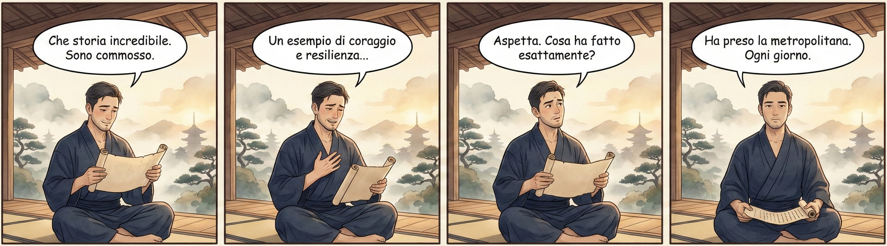

# Cose Belle & Altre Storie - Edizione #25
*Sabato 24 gennaio 2026 - Il buongiorno del weekend*

---

Un'altra settimana è volata via, e con lei anche il primo mese dell'anno che, tra una fetta di pandoro (sì, ancora!) e temperature che flirtano pericolosamente con lo zero assoluto, si appresta a salutarci. Pazzesco come vola il tempo quando ti diverti...

> Absence in love is like water upon fire; a little quickens, but much extinguishes it.
> Hannah More

Questa settimana il sottoscritto è stato risucchiato in un vortice lavorativo di quelli che ti fanno rivalutare le scelte di vita, con il risultato che la consueta esplorazione degli angoli più interessanti di internet ha subito un comprensibile rallentamento. In compenso, sto accumulando materiale di lettura e visione che promette scintille per le prossime edizioni. Stay tuned, come dicono quelli che vogliono sembrare internazionali.

Ma non temete: quello che manca in quantità, questa settimana lo compensiamo in qualità. O almeno, questa è la narrazione che mi sono costruito per dormire meglio la notte.

Prendetevi un caffè (o quello che preferite), mettetevi comodi, e partiamo.

---

## In Questo Numero

Parliamo di un fenomeno linguistico che probabilmente vi ha già fatto alzare un sopracciglio almeno una volta (o forse no!): quella comunicazione talmente zuccherosa da provocare carie cerebrali. Poi esploriamo l'ipotesi che esistano due tipi di ADHD (e no, uno non è quello che usiamo come scusa per non rispondere ai messaggi). Si parla anche di alieni cacciatori con un nuovo film finalmente all'altezza del nome, e chiudiamo con una canzone che vi riporterà dritti ai corridoi del liceo, con tutto il carico emotivo che questo comporta.

---

## La Riflessione della Settimana

**Quando le parole diventano zucchero filato**

C'è un momento preciso in cui ti rendi conto che qualcosa nel dibattito pubblico si è rotto. È quel momento in cui provi a fare un'osservazione basata su fatti verificabili e la risposta che ricevi è uno sguardo ferito, come se avessi appena insultato il gatto di qualcuno.

Yasmina Pani, in un video che vi consiglio caldamente, chiama questo fenomeno "linguaggio petaloso", un termine che da solo vale il prezzo del biglietto. Si tratta di quella forma di comunicazione talmente leziosa, talmente intrisa di pathos e aggettivi iperbolici, da rendere qualsiasi analisi razionale un atto di crudeltà sociale.

Il meccanismo è sottile e, proprio per questo, insidioso. A differenza della retorica aggressiva, facilmente identificabile e criticabile, il linguaggio petaloso si presenta con i fiocchetti. È il giornalismo che trasforma una laurea conseguita nei tempi previsti in un'impresa epica. È il post sui social che celebra il pendolarismo quotidiano come fosse la traversata dell'Atlantico in solitaria. È, in sostanza, la magnificazione sistematica dell'ordinario, confezionata per farci sentire tutti un po' più speciali, un po' più buoni, un po' più parte di qualcosa.

Il problema? Dietro i fiocchetti, spesso, c'è il vuoto.

Già Aristotele, nella sua *Retorica*, distingueva tra il logos (l'argomentazione razionale), l'ethos (la credibilità di chi parla) e il pathos (l'appello alle emozioni). Il filosofo greco non demonizzava il pathos, anzi, lo considerava uno strumento legittimo della persuasione. Ma avvertiva che senza logos, senza un fondamento razionale, il discorso si trasforma in manipolazione. Sono passati circa 2.400 anni e, con tutto il rispetto per il progresso, sembra che abbiamo deciso collettivamente di buttare il logos dalla finestra e tenerci solo il pathos, possibilmente condito con qualche cuoricino.

La conseguenza più preoccupante riguarda il dibattito pubblico. Quando l'emozione diventa l'unico criterio di validità, chi prova a mantenere un approccio analitico viene automaticamente etichettato come freddo, cinico, privo di empatia. È un cortocircuito perfetto: la capacità di provare emozioni è diventata paradossalmente più importante della capacità di comprendere i fenomeni. E così ci ritroviamo a discutere di problemi complessi armati solo di sensibilità e buone intenzioni, che notoriamente non sono sufficienti a costruire ponti o a far funzionare gli ospedali.

Come ha scritto Jonathan Swift con la consueta eleganza britannica:

> Il ragionamento non farà mai correggere a un uomo un'opinione sbagliata, che non ha acquisito tramite il ragionamento. 

In altre parole: se qualcuno è arrivato a una conclusione attraverso le emozioni, non lo convincerete con i fatti. È una partita persa in partenza.

L'unico antidoto, suggerisce Pani, è lo sviluppo di *anticorpi critici*. Imparare a riconoscere quando qualcuno sta usando un linguaggio patetico senza portare argomentazioni. Diffidare delle storie troppo belle per essere vere (perché spesso non lo sono). E, soprattutto, ricordarsi che sentirsi bene non è la stessa cosa che avere ragione.

Detto questo, mi rendo conto che fare un discorso analitico su fatti oggettivi stia diventando un'impresa che richiede cautela diplomatica da negoziato internazionale. Il confine tra "persona che ragiona" e "individuo socialmente sgradevole" si è fatto sottilissimo. Ma mi domando, con genuina curiosità antropologica: il problema è chi prova a ragionare, o chi fatica a seguire il ragionamento?

Dipende da quanto zucchero avete messo nel caffè.

[Il video di Yasmina Pani](https://www.youtube.com/watch?v=bpT4M9Fg-9g)

---

## Scoperte & Curiosità

### Quello che non sapevo e ora sì

**L'ADHD potrebbe essere due disturbi diversi**

Un articolo su Psyche propone una distinzione che ha il sapore della rivoluzione copernicana applicata alla psichiatria: e se l'ADHD non fosse un singolo disturbo, ma due condizioni distinte che abbiamo raggruppato insieme per comodità diagnostica?

Il Tipo I sarebbe la forma classica, quella di origine genetica e neurologica, presente fin dall'infanzia e ben documentata dalla letteratura scientifica. Il Tipo II, invece, sarebbe qualcosa di completamente diverso: un disturbo indotto dall'eccessiva stimolazione digitale, dalla frammentazione costante dell'attenzione, dall'abitudine a processare informazioni in pillole sempre più piccole.

La differenza non è accademica. Il Tipo I risponde ai farmaci tradizionali. Il Tipo II, secondo questa ipotesi, no. Richiede invece un intervento drastico sullo stile di vita: meno schermi, meno notifiche, meno quella sensazione di dover controllare il telefono ogni trentasette secondi.

C'è qualcosa di ironico nel fatto che potremmo aver creato, attraverso le nostre meravigliose tecnologie, una nuova forma di disturbo dell'attenzione. È come se avessimo inventato la ruota e poi ci fossimo lamentati del mal di schiena per i troppi viaggi.

Il collegamento con il linguaggio petaloso di cui parlavo sopra non è casuale. Un'attenzione frammentata è un'attenzione che fatica a seguire ragionamenti complessi. E quando non riesci a seguire un ragionamento complesso, le emozioni semplici diventano l'unico linguaggio comprensibile.

[Leggi l'articolo completo](https://psyche.co/ideas/in-an-era-of-split-attention-there-is-more-than-one-type-of-adhd)

---

## Intrattenimento (Mica) Banale

### Il film che vale la pena

**Predator: Badlands - Finalmente un sequel degno di questo nome**

Dopo anni di sequel che definire "discutibili" è un esercizio di diplomazia (sapete di cosa parlo se avete seguito le mie lamentele su certi altri franchise che insistono a resuscitare mostri e anni '80), finalmente un Predator che si merita il nome.

Il settimo capitolo della saga fa qualcosa di coraggioso: cambia prospettiva. Il protagonista non è un umano muscoloso che suda nella giungla, ma Dek, un giovane Yautja, uno degli alieni cacciatori. L'alleanza con un'androide della Weyland-Yutani (sì, quella corporazione, per chi segue l'universo di Alien) aggiunge strati di complessità inaspettati.

Dan Trachtenberg, già regista del sorprendente Prey, conferma di aver capito qualcosa che i suoi predecessori avevano dimenticato: i Predator funzionano quando li tratti con rispetto, non quando li trasformi in figurine per adolescenti.

Non è perfetto. Ci sono due o tre compromessi narrativi che richiedono una certa sospensione dell'incredulità. Ma dopo quello che abbiamo dovuto sopportare negli anni recenti, consideratelo un trionfo.

[Se interessati potete leggere la trama su Wikipedia, ma vi consiglio di guardarlo senza spoiler](https://it.wikipedia.org/wiki/Predator:_Badlands)

---

## La Colonna Sonora

[The Red Jumpsuit Apparatus - Your Guardian Angel](https://www.youtube.com/watch?v=Q7Em4fUOrZo)

Quando i miei genitori mi dicevano che gli anni del liceo mi sarebbero mancati, li guardavo con quella superiorità tipica dei diciassettenni che sono convinti di aver capito tutto. Avevano ragione loro, ovviamente. Come sempre.

Your Guardian Angel è una di quelle canzoni che ti riportano istantaneamente in un'epoca specifica. I corridoi, le ore buche passate a non fare niente di produttivo, la sensazione che il tempo fosse infinito e che le decisioni importanti potessero sempre aspettare.

Non è nostalgia nel senso stucchevole del termine. È più la consapevolezza che c'è stato un momento in cui le cose erano contemporaneamente più semplici e più intense, e che quel momento non tornerà. Ma la musica, almeno quella, resta.

Dovrò trovare un modo per spiegarlo ai miei figli, un giorno. Probabilmente non ci crederanno neanche loro. E il ciclo continuerà.

---

## & Un'Altra Cosa

Questa settimana la cassetta degli attrezzi è più leggera del solito. Il lavoro ha quella fastidiosa abitudine di richiedere tempo e attenzione proprio quando vorresti dedicarli ad altro. Ma c'è un lato positivo: sto accumulando una lista di letture, video e scoperte che promette di rendere le prossime edizioni particolarmente dense.

È un po' come quando accumuli serie TV da vedere e poi ti ritrovi con un backlog che richiederebbe un anno sabbatico per essere smaltito. Solo che qui parliamo di contenuti che, almeno in teoria, dovrebbero renderci persone migliori. O quantomeno più informate. Che poi sia la stessa cosa è tutto da dimostrare.

Nel frattempo, se avete scoperto qualcosa di interessante durante la settimana, i miei messaggi sono sempre aperti. La curation, dopotutto, è più divertente quando diventa un esercizio collettivo.

---

## Prima di Salutarci...

E anche questa settimana è fatta! Un quarto di cento, il che significa che se arriviamo a cento avrò scritto l'equivalente di un piccolo libro, solo più frammentato e con più link a video di YouTube.

Se qualcosa di quello che avete letto vi ha fatto riflettere, sorridere, o anche solo alzare un sopracciglio, considerate di condividerlo con qualcuno che potrebbe apprezzare. Il passaparola resta il miglior algoritmo.

Buon sabato, e alla prossima esplorazione!

---

*PS: Questa newsletter ha come unico scopo quello di condividere curiosità e belle scoperte. Tutti i link e i contenuti sono selezionati a titolo personale e gratuito.*

Se sei arrivato fin qui, evidentemente qualcosa ti ha incuriosito. Bene! Puoi iscriverti per ricevere queste piccole collezioni ogni sabato mattina, direttamente nella tua casella email.
